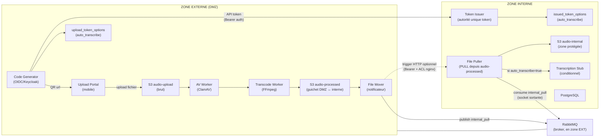
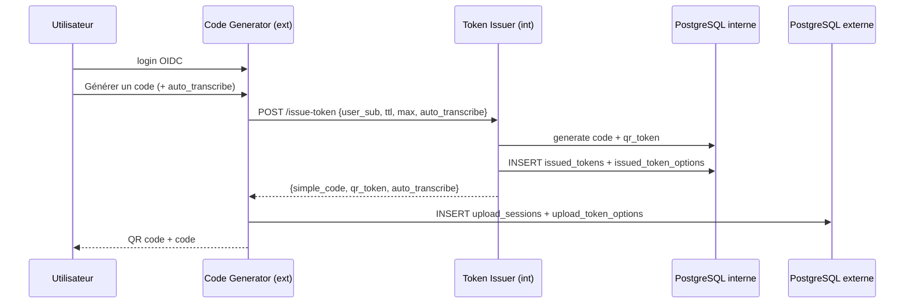
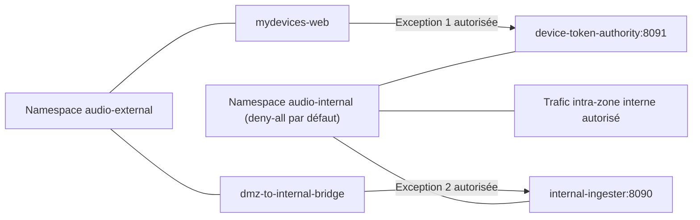
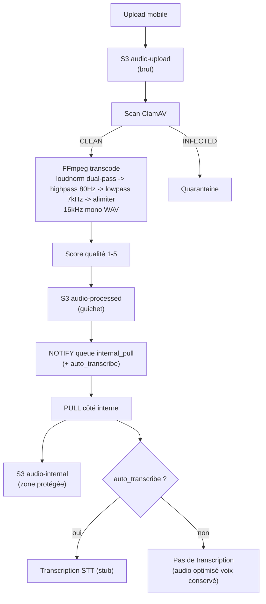
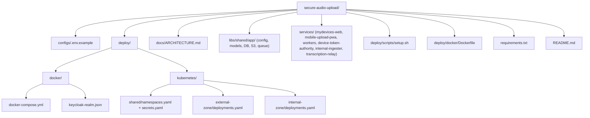

# Secure Audio Upload Pipeline

> Système sécurisé d'upload audio par QR code avec cloisonnement zone externe / zone interne, génération de tokens côté interne, analyse antivirale, transcodage et transcription optionnelle.

## Parcours De Lecture Recommandé

1. `README.md` (vue d'ensemble + mode d'emploi)
2. `docs/ARCHITECTURE.md` (architecture détaillée + sécurité + flux)
3. `tests/DISCOVERY_TEST_PLAN.md` (test humain guidé)
4. `tests/TEST_COVERAGE_STATUS.md` (statut de couverture et résultats)

## Principe fondamental

**La zone interne est l'autorité de confiance.** Aucun identifiant de session n'est généré côté externe. Le `device-token-authority` (zone interne) est la seule source de vérité pour les codes d'upload. La zone externe ne fait que relayer et consommer ces tokens — elle ne peut en aucun cas en forger.

## Architecture



> Le broker RabbitMQ vit côté DMZ et la zone interne ouvre une socket
> sortante pour publier *et* consommer ses queues. Aucune connexion HTTP
> entrante n'atteint la zone interne hors du chemin `pull-trigger.…` qui
> est filtré par ACL IP au niveau nginx puis bearer applicatif.

## Flux de génération de token (interne → externe)



Le mydevices-web **ne contient aucune logique de génération de token**. Il délègue à 100% au device-token-authority via API authentifiée (bearer token). La table `issued_tokens` en zone interne fait foi.

## Composants

| Service | Zone | Port | Rôle |
|---------|------|------|------|
| **mydevices-web** | Externe | 8080 | Interface OIDC, demande de token au device-token-authority interne, affiche QR |
| **mobile-upload-pwa** | Externe | 8081 | Page mobile d'upload audio (QR/code), WebSocket temps réel |
| **clamav-scanner** | Externe | — | Scan ClamAV, quarantaine si virus |
| **audio-normalizer** | Externe | — | FFmpeg : loudnorm dual-pass (linear) **conditionnel** (sondage RMS à +60s/+5min, skip si déjà ≥ -30 dBFS — cf bench [bench/reports/SYNTHESE.md](bench/reports/SYNTHESE.md)), highpass 80Hz, lowpass 7kHz, limiter, score qualité 1-5 |
| **dmz-to-internal-bridge** | Externe | — | Publie une notification *fichier prêt* sur la queue durable `internal_pull` (AMQP) ; trigger HTTP optionnel pour ramener la latence quasi-zéro |
| **device-token-authority** | **Interne** | 8091 | **Autorité unique** de génération des tokens (simple_code + qr_token) |
| **internal-ingester** | Interne | 8090 | Consomme `internal_pull` (poll 30 s par défaut) et tire les fichiers transcodés depuis le bucket `audio-processed` (guichet) ; expose `/api/v1/pull-trigger` (bearer + ACL) pour wake-up |
| **transcription-relay** | Interne | — | Backend par défaut (`TRANSCRIPTION_BACKEND=stub`), simule la STT via la queue locale |
| **MCR push** | Interne (internal-ingester) | — | Backend `mcr` : pousse le fichier transcodé vers la plateforme MCR via OIDC refresh token (cf [docs/integrate-with-mcr.md](docs/integrate-with-mcr.md)) |
| **Kevent / Mirai** | Interne (internal-ingester) | — | Backend `kevent` : Whisper + pyannote diarisation + intelligence de réunion LLM (speaker naming, **glossary correction**, OOB cleaning, reformulation, analyse 5 sections). Glossaire administratif embarqué image (fallback) ou monté en ConfigMap K8s sans rebuild — cf [docs/integrate-with-kevent.md](docs/integrate-with-kevent.md) |

## Principes de sécurité

1. **Tokens générés côté interne** — Le `device-token-authority` est la seule autorité. La zone externe ne peut pas forger de codes de session. En cas de compromission DMZ, aucun token frauduleux ne peut être créé.

2. **Pattern PULL strict (notification + données)** — Aucune donnée ni notification n'est *poussée* vers la zone interne. La zone externe publie sur la queue AMQP `internal_pull` ; la zone interne ouvre une socket sortante vers le broker pour la consommer, puis tire le fichier depuis S3. Le wake-up HTTP optionnel est purement une optimisation de latence et fonctionne sous bearer + ACL nginx — sa rotation n'a aucun impact fonctionnel grâce au polling de la queue.

3. **Surface d'entrée contrôlée vers la zone interne** — La zone interne n'expose que deux services :
   - `device-token-authority:8091` ← accessible uniquement par `mydevices-web` via NetworkPolicy intra-cluster
   - `internal-ingester` via Ingress public restreint `pull-trigger.fake-domain.name` : annotation `whitelist-source-range` (IP NAT egress du dmz-to-internal-bridge + IPs admins), bearer `INTERNAL_PUSH_TRIGGER_TOKEN`, et 4e couche optionnelle d'ACL applicative. Le port 8090 intra-cluster ne sert plus qu'aux probes Kubernetes (`/healthz`).

4. **3 stockages S3 séparés** — `audio-upload` (bruts, DMZ), `audio-processed` (transcodés, *guichet* DMZ↔interne avec IAM segmenté writer/reader), `audio-internal` (comptes usagers, zone protégée uniquement)

5. **Codes éphémères** — QR codes avec TTL configurable (15 min → 7 jours), limite d'uploads par session configurable (299 par défaut, plafond serveur silencieux côté pipeline)

6. **Analyse antivirale obligatoire** — Tout fichier passe par ClamAV. Fichiers infectés en quarantaine.

7. **Transfert idempotent** — Si une notification `file_ready` est rejouée (retry réseau/queue), le `internal-ingester` détecte le fichier déjà importé et répond `already_pulled` sans doublonner les données.

8. **Enrôlement persistant device navigateur** — Le portail upload enrôle le navigateur (token device persistant), vérifie sa validité à chaque initialisation et permet la révocation unitaire/globale côté QR interne et admin.

## Démarrage rapide

## Captures D'écran

1. QR Generator (création de code, options token, suivi activité)


2. Upload mobile (code court, upload, application PWA)


3. Admin / Compte-rendu (suivi pipeline et transcription)


### Docker Compose

```bash
# Cloner le repo
git clone https://github.com/votre-org/secure-audio-upload.git
cd secure-audio-upload

# Copier la config
cp configs/.env.example configs/.env

# Lancer (script automatisé)
bash deploy/scripts/setup.sh
```

Ou manuellement :

```bash
docker compose -f deploy/docker/docker-compose.yml up -d
```

### Compatibilité AMD64 / ARM64

La stack Docker Compose est compatible `linux/amd64` et `linux/arm64` :
- Images infra multi-arch (PostgreSQL, RabbitMQ, MinIO, Keycloak, ClamAV)
- Image applicative basée sur `python:3.12-slim` (multi-arch)
- Les images infra du `docker-compose.yml` sont figées par digest (`image: tag@sha256:...`) pour une exécution reproductible sur les deux architectures.

Pour forcer un test sur une architecture donnée :

```bash
# Test amd64
DOCKER_DEFAULT_PLATFORM=linux/amd64 docker compose -f deploy/docker/docker-compose.yml up -d --build

# Test arm64
DOCKER_DEFAULT_PLATFORM=linux/arm64 docker compose -f deploy/docker/docker-compose.yml up -d --build
```

Mise à jour des digests (quand nécessaire) :

```bash
docker buildx imagetools inspect <image:tag> | sed -n '1,6p'
```

## Mode d'emploi

### 0. Si la stack est déjà installée

> Exécuter d'abord le cahier de test humain pour valider les parcours.

[tests/DISCOVERY_TEST_PLAN.md](tests/DISCOVERY_TEST_PLAN.md)


### 1. Démarrer la stack

```bash
docker compose -f deploy/docker/docker-compose.yml up -d --build
```

Ou avec détection automatique de l'IP hôte (recommandé pour tests mobile/LAN):

```bash
./deploy/scripts/compose-up.sh
```

Pour forcer les URLs générées (QR/code) sur l'IP publique ou LAN du serveur :

```bash
PUBLIC_HOST=<IP_PUBLIQUE_OU_LAN> docker compose -f deploy/docker/docker-compose.yml up -d --build
```

Exemple : `PUBLIC_HOST=192.168.1.50`
Important : ouvre aussi le Code Generator via cette même IP (`http://<IP>:8080`) et pas via `localhost`.
Note : `PUBLIC_HOST` est prioritaire pour la génération des URLs QR (`http://<PUBLIC_HOST>:8081/upload/...`).

### 2. Vérifier que tout est démarré

```bash
docker compose -f deploy/docker/docker-compose.yml ps
```

Vérifications rapides :

```bash
curl -sS http://localhost:8090/health
curl -sS http://localhost:8091/health
```

### 3. Utiliser l'application (web)

1. Ouvrir le code generator : `http://localhost:8080`
2. Se connecter via OIDC (Keycloak)
3. Générer un code/QR
   - En mode test Docker Compose, des durées courtes `15s` et `30s` sont disponibles
4. Ouvrir le portail d'upload : `http://localhost:8081`
5. Uploader un fichier audio et suivre les statuts
   - Une fenêtre de grâce après expiration (`UPLOAD_EXPIRY_GRACE_SECONDS`) permet de finir un upload en cours.
   - Purge automatique côté upload: exécution quotidienne, suppression des fichiers de plus de 12h.

### 4. Utiliser l'application (mobile, même Wi-Fi)

1. Trouver l'IP locale de la machine hôte (ex: `192.168.x.x`)
2. Accéder depuis le mobile :
   - `http://<IP_LOCALE>:8080`
   - `http://<IP_LOCALE>:8081`
   - `http://<IP_LOCALE>:8082` (admin)
3. Les QR codes générés utiliseront cette IP (et non `localhost`) si `PUBLIC_HOST` est défini.

### 5. Suivi administration

- Admin Portal : `http://localhost:8082`
- Fonctions disponibles :
  - suivi sessions/fichiers pipeline
  - suivi transcription (statuts + journal des appels stub STT)
  - affichage impact de normalisation (LUFS/TP/LRA avant/après + delta) directement dans la liste des fichiers
  - visualisation S3 (`upload`, `processed`, `internal`)
  - téléchargement d'objets S3

### 5.bis Interface code generator (QR)

- Formulaire de génération:
  - checkbox `Lancer la retranscription automatique et l'ajouter dans MirAI Compte-rendu`
  - cette option est associée au token généré et pilote l'appel du stub de transcription en fin de pipeline
  - dans tous les cas, les fichiers audio restent optimisés pour la voix (analyse + transcodage)
- Dans la liste des fichiers:
  - le nom long est forcé à la ligne pour rester lisible dans le bloc gris clair
  - `Télécharger` et `Écouter` sont disponibles pour chaque fichier
- `2.5/5` = indice de qualité audio (score 1 à 5)
  - un infobulle `i` décrit le calcul (RMS, ratio de silence, durée, fréquence d'échantillonnage)
- Bouton `Purger liste + fichiers`:
  - supprime la liste de sessions côté utilisateur
  - supprime les objets audio associés dans les buckets externes
- Bouton `Impact normalisation` (par fichier transcodé):
  - affiche une comparaison avant/après (`LUFS`, `True Peak`, `LRA`) et les deltas
- Gestion des appareils enrôlés:
  - liste des devices du compte utilisateur (avec validité restante en jours)
  - affichage du compteur d'appareils actifs
  - bouton `Voir révoqués` / `Masquer révoqués` pour alterner entre vue active et vue complète
  - renommage d'un device
  - révocation d'un device
  - renouvellement d'un device `+7j` (prolonge la validité et ajoute un quota de téléchargements)
  - révocation globale des devices du compte
  - le bouton `Renouveller` est mis en évidence si le token expire dans moins de 2 jours ou s'il reste moins de 2 uploads
- Sur les sessions:
  - affichage `téléchargements restants` et `utilisés/max`
  - affichage `récents 24h`
  - renouvellement `+7 jours` possible depuis l'interface

### 5.ter Enrôlement device (upload)

- À l'ouverture du lien QR, le navigateur:
  - tente de réutiliser un `device_token` persistant (`localStorage`)
  - sinon déclenche un enrôlement initial (clé device + fingerprint)
- Chaque requête upload/status envoie le header `X-Device-Token`.
- Le backend applique:
  - fast-path local (signature + rétention),
  - validation backend forte à l'initialisation de session (détection rapide des révocations),
  - puis validation asynchrone backend périodique.
- Si la validation backend échoue au-delà de la fenêtre configurée, les requêtes sont refusées avec message explicite invitant à renouveler le token (durée + téléchargements) dans l'interface admin/QR.

### 6. Sécurité API interne

- `API-token` (`/api/v1/issue-token`, `/api/v1/validate-token`) : authentification obligatoire par header
  `Authorization: Bearer <INTERNAL_API_TOKEN>`.
- `NOTIFY` (`/api/notify-status`) : authentification obligatoire par le même header Bearer.
- Vérification de token en comparaison constante (`hmac.compare_digest`).
- Les services refusent de démarrer si `INTERNAL_API_TOKEN` est faible (minimum 32 caractères, pas de placeholder
  type `change-me`, `dev-`, `test-`, etc.).

### 7. Créer des comptes de test Keycloak (script local non versionné)

Un wrapper local est fourni pour éviter d'exposer des credentials admin dans Git.

1. Copier le fichier d'exemple :

```bash
cp deploy/kubernetes/scripts/create-keycloak-test-users.local.env.example \
   deploy/kubernetes/scripts/create-keycloak-test-users.local.env
```

2. Modifier localement `deploy/kubernetes/scripts/create-keycloak-test-users.local.env`
   avec les vraies valeurs `KEYCLOAK_ADMIN_USER` et `KEYCLOAK_ADMIN_PASSWORD`.

3. Lancer la création des comptes :

```bash
./deploy/kubernetes/scripts/create-keycloak-test-users.local.sh
```

Le script crée/met à jour par défaut `testuser01` à `testuser10`.

### 8. Scénario de test bout-en-bout (E2E)

1. Générer une session/QR via `https://import-audio.fake-domain.name`.
2. Depuis mobile, ouvrir le lien QR et uploader un audio court.
3. Vérifier la progression du statut : `uploaded` -> `scanned` -> `transcoded` -> `transferred`.
4. Contrôler côté admin (`http://localhost:8082`) que la session apparaît avec ses événements.
5. Vérifier la présence des objets dans les buckets :
   - `audio-upload` / `ingate-audio` pour l'entrée,
   - `audio-processed` pour le transcodé,
   - `audio-internal` après transfert interne.
6. Tester lecture et téléchargement des fichiers source/transcodé depuis l'interface.
7. Vérifier la transcription selon le flag:
   - checkbox activée: stub appelé et journal visible dans l'admin,
   - checkbox désactivée: aucune mise en file transcription (stub non appelé).

### Accès local (sans exposer d'information sensible)

| Service | URL | Authentification |
|---------|-----|------------------|
| Code Generator | http://localhost:8080 | OIDC Keycloak (utilisateurs via variables/realm) |
| Upload Portal | http://localhost:8081 | accès par code/QR |
| Admin Portal | http://localhost:8082 | OIDC Keycloak + filtre admin |
| Token Issuer (API) | http://localhost:8091/health | API interne (bearer token) |
| Keycloak Admin | http://localhost:8180 | compte admin défini par configuration |
| RabbitMQ | http://localhost:15672 | identifiants via variables d'environnement |
| MinIO Upload | http://localhost:9001 | identifiants via variables d'environnement |
| MinIO Processed | http://localhost:9003 | identifiants via variables d'environnement |
| MinIO Internal | http://localhost:9005 | identifiants via variables d'environnement |

### Docker Compose (identifiants de test uniquement)

Les identifiants ci-dessous sont **uniquement pour un environnement local de test**.  
Ils ne doivent jamais être réutilisés en intégration/production.

| Service | URL | Identifiants de test |
|---------|-----|----------------------|
| Code Generator (OIDC user) | http://localhost:8080 | `testuser` / `testpassword` |
| Admin Portal (OIDC user) | http://localhost:8082 | `admin` / `adminpassword` (test, change-me en prod) |
| Keycloak Admin | http://localhost:8180 | `admin` / `admin` (test, change-me en prod) |
| RabbitMQ | http://localhost:15672 | `audio` / `change-me-rabbit` |
| MinIO Upload | http://localhost:9001 | `minioadmin` / `minioadmin` (test, change-me en prod) |
| MinIO Processed | http://localhost:9003 | `minioadmin` / `minioadmin` (test, change-me en prod) |
| MinIO Internal | http://localhost:9005 | `minioadmin` / `minioadmin` (test, change-me en prod) |

Pour générer un token interne robuste :

```bash
python - <<'PY'
import secrets
print(secrets.token_urlsafe(32))
PY
```

### Kubernetes

```bash
# Namespaces + NetworkPolicies
kubectl apply -f deploy/kubernetes/shared/namespaces.yaml

# Secrets (éditer les valeurs avant !)
kubectl apply -f deploy/kubernetes/shared/secrets.yaml

# Zone externe (namespace: audio-external)
kubectl apply -f deploy/kubernetes/external-zone/

# Zone interne (namespace: audio-internal)
kubectl apply -f deploy/kubernetes/internal-zone/
```

Autoscaling Kubernetes configuré:
- `audio-normalizer` via KEDA sur la queue `transcode` (jusqu'à 50 replicas)
- `dmz-to-internal-bridge` via KEDA sur la queue `file_ready` (jusqu'à 50 replicas)
- `transcription-relay` via KEDA sur la queue `transcription` (jusqu'à 20 replicas)
- `internal-ingester` via HPA CPU/Mémoire (1 à 20 replicas)

### Runbook debug transfert (Kubernetes)

Quand un fichier reste bloqué en `transferring` ou `transcoded`, vérifier dans cet ordre:

```bash
# 1) Santé pods
kubectl -n audio-external get pods
kubectl -n audio-internal get pods

# 2) Autoscaling actif
kubectl -n audio-external get scaledobject
kubectl -n audio-internal get scaledobject
kubectl -n audio-internal get hpa

# 3) Backlog RabbitMQ (queue file_ready/transcode/transcription)
kubectl -n audio-external logs deploy/rabbitmq --tail=200

# 4) Chaîne de transfert
kubectl -n audio-external logs deploy/dmz-to-internal-bridge --tail=200
kubectl -n audio-internal logs deploy/internal-ingester --tail=200

# 5) Redémarrage ciblé (si nécessaire)
kubectl -n audio-external rollout restart deploy/dmz-to-internal-bridge
kubectl -n audio-internal rollout restart deploy/internal-ingester
```

Points à confirmer:
- `dmz-to-internal-bridge` publie bien la notification interne (pas d'erreur HTTP vers `internal-ingester`).
- `internal-ingester` répond `already_pulled` en cas de rejeu (idempotence), sans créer de doublon.
- Les secrets S3 sont présents et identiques dans les namespaces `audio-external` et `audio-internal`.

## Isolation réseau

### Docker Compose (3 réseaux)

| Réseau | Services | Rôle |
|--------|----------|------|
| `external-net` | mydevices-web, mobile-upload-pwa, admin-console, workers, ClamAV, MinIO upload/processed, PostgreSQL ext | Zone DMZ |
| `internal-net` | device-token-authority, internal-ingester, transcription-relay, admin-console, MinIO internal, PostgreSQL int | Zone interne |
| `dmz-net` | mydevices-web ↔ device-token-authority, dmz-to-internal-bridge ↔ internal-ingester | Bridge contrôlé (2 flux seulement) |

### Kubernetes (NetworkPolicies)



## Configuration

Variables d'environnement principales (`configs/.env.example`) :

| Variable | Défaut | Description |
|----------|--------|-------------|
| `CODE_TTL_MINUTES` | `10080` | Durée de validité par défaut des codes (7 jours) |
| `CODE_TTL_MAX_MINUTES` | `10080` | TTL max (7 jours) |
| `ALLOW_SHORT_QR_TTL_SECONDS_TEST` | `false` | Autorise les TTL de test `15s`/`30s` |
| `MAX_UPLOADS_PER_SESSION` | `299` | Uploads max par code (plafond silencieux côté serveur) |
| `CODE_LENGTH` | `6` | Longueur du code simple |
| `UPLOAD_STATUS_VIEW_TTL_MINUTES` | `60` | Durée de consultation du statut après expiration |
| `UPLOAD_EXPIRY_GRACE_SECONDS` | `300` | Fenêtre de grâce pour terminer un upload après expiration du code |
| `EXTERNAL_PURGE_INTERVAL_SECONDS` | `86400` | Fréquence de purge automatique côté upload portal |
| `EXTERNAL_PURGE_MAX_AGE_HOURS` | `12` | Âge max des fichiers externes avant purge |
| `INTERNAL_PURGE_INTERVAL_SECONDS` | `86400` | Fréquence de purge automatique côté internal-ingester |
| `INTERNAL_PURGE_MAX_AGE_DAYS` | `7` | Âge max des fichiers importés côté intranet avant purge |
| `INTERNAL_PUSH_TRIGGER_URL` | `""` | URL HTTP(S) de wake-up cross-cluster vers `pull-trigger.…/api/v1/pull-trigger`. Toute valeur non-URL (`""`, `deactivate`, `false`, …) désactive le trigger ; le internal-ingester continue à drainer la queue par polling |
| `INTERNAL_PUSH_TRIGGER_TOKEN` | — | Bearer pour `/api/v1/pull-trigger` (côté dmz-to-internal-bridge et internal-ingester). Distinct de `INTERNAL_API_TOKEN`, rotable indépendamment |
| `INTERNAL_PUSH_TRIGGER_IP_ALLOWLIST` | `""` | CIDR list applicative redondante côté internal-ingester (vide = on s'appuie sur l'ACL nginx) |
| `INTERNAL_PULL_QUEUE_INTERVAL_SECONDS` | `30` | Intervalle de drain périodique de la queue `internal_pull` côté internal-ingester |
| `PULL_TRIGGER_HTTP_TIMEOUT_SECONDS` | `3` | Timeout du POST best-effort de dmz-to-internal-bridge vers le trigger HTTP |
| `QUEUE_MAX_RETRIES` | `5` | Nombre max de retries (via header `x-retry-count`) avant qu'un message empoisonné soit droppé par les workers consommateurs |
| `DEVICE_TOKEN_RETENTION_HOURS` | `168` | Durée de rétention d'un enrôlement device (zone interne) |
| `DEVICE_REVALIDATE_INTERVAL_SECONDS` | `14400` | Intervalle de revalidation asynchrone des device tokens côté upload |
| `DEVICE_REVALIDATE_MAX_FAILURE_SECONDS` | `14400` | Fenêtre max d'échec backend avant refus des requêtes device |
| `DEVICE_API_PROXY_BASE_URL` | `http://mydevices-web:8080` | URL du proxy API device utilisé par mobile-upload-pwa |
| `NORMALIZATION_CACHE_TTL_SECONDS` | `3600` | Durée du cache des métriques de normalisation côté admin |
| `NORMALIZATION_MAX_COMPUTE_PER_REFRESH` | `0` | Nombre max d'analyses de normalisation lancées par refresh dashboard (0 = non bloquant) |
| `NORMALIZATION_ANALYSIS_MAX_SECONDS` | `180` | Durée max de l'échantillon analysé pour l'impact de normalisation (page QR/interne) |
| `TOKEN_ISSUER_API_URL` | `http://device-token-authority:8091/api/v1/issue-token` | URL du device-token-authority interne |
| `INTERNAL_API_TOKEN` | — | Bearer token partagé inter-zones |
| `PUBLIC_HOST` | — | Hôte/IP publique utilisée pour les URLs générées (QR + redirects) |
| `OIDC_ISSUER` | — | URL Keycloak |
| `OIDC_INTERNAL_ISSUER` | `http://keycloak:8080/realms/openwebui` | URL Keycloak utilisée par les services Docker pour les appels serveur-à-serveur OIDC |
| `FFMPEG_AUDIO_FILTER` | `highpass=f=80,lowpass=f=7000,loudnorm=...` | Filtre FFmpeg voix |
| `ENABLE_LOUDNORM` | `true` | Active/desactive `loudnorm` dans le worker de transcodage (mode dual-pass `linear=true`). Ignoré si `LOUDNORM_AUTO_DECISION=true`. |
| `POST_LOUDNORM_FILTER_CHAIN` | `highpass=f=80,lowpass=f=7000,alimiter=limit=0.95` | Filtres appliqués après loudnorm (ordre strict) |
| `LOUDNORM_AUTO_DECISION` | `true` | Sondage RMS par-fichier : si l'audio est déjà au-dessus du seuil, skip la passe loudnorm (couteuse) et garde uniquement le post-chain |
| `LOUDNORM_RMS_THRESHOLD_DBFS` | `-30.0` | Seuil de décision (dBFS). Si max RMS mesuré ≥ seuil → skip ; sinon → loudnorm dual-pass |
| `LOUDNORM_PROBE_OFFSETS_S` | `60,300` | Offsets (CSV, secondes) où sont prélevées les fenêtres de mesure RMS |
| `LOUDNORM_PROBE_DURATION_S` | `5.0` | Durée de chaque fenêtre de mesure (secondes) |

## Mesure de l'impact de normalisation

Script local:

```bash
python deploy/scripts/measure_normalization_impact.py \
  --source /chemin/source.wav \
  --normalized /chemin/normalise.wav
```

JSON:

```bash
python deploy/scripts/measure_normalization_impact.py \
  --source /chemin/source.wav \
  --normalized /chemin/normalise.wav \
  --json
```

## Pipeline de traitement audio



> **Roadmap pipeline V2 (backend Kevent)** — planifié, non implémenté :
> refonte du `_transcribe_via_kevent` monolithique en **9 step functions
> idempotentes** (1 queue RabbitMQ par étape) avec **fan-out parallèle
> post-whisper** : `glossary`, `oob_cleaning`, `reformulation` et un
> `meeting_cr` *provisoire* (v1 sans locuteurs) sont lancés en parallèle
> de `diarize`, puis `meeting_cr` *final* (v2 avec locuteurs) est rejoué
> après `speaker_names`. Cible : TTFV (1er compte-rendu utile visible
> en UI) ramené de ~25 min à ~5 min. Plan complet :
> `~/.claude/plans/federated-finding-whisper.md` et section *Évolution
> prévue* dans [docs/integrate-with-kevent.md](docs/integrate-with-kevent.md#évolution-prévue--pipeline-v2-dag-composable-sprint-reliability).

## Formats audio supportés

MP3, WAV, OGG, FLAC, M4A, AAC, WMA, OPUS, WEBM

## Arborescence du projet



## Licence

Apache-2.0

## Validation enrôlement device

- Cahier de tests: `tests/TEST_PLAN_DEVICE_ENROLLMENT.md`
- Test unitaire token device: `tests/unit/test_device_token.py`
- Scénario simulé: `tests/scenarios/device_enrollment_sequence.sh`
- Synthèse couverture/statut: `tests/TEST_COVERAGE_STATUS.md`
