# Mes Réunions — pipeline sécurisé d'upload, transcription et compte-rendu

> Service souverain de captation audio par QR code, avec cloisonnement zone externe / zone interne, transcription Whisper + diarisation pyannote, et génération de comptes-rendus structurés par LLM. Conçu pour les ministères français — design DSFR, déploiement Scaleway, SSO Keycloak.

---

## 1. À qui ça sert (et à quoi)

- **Pour l'agent en réunion** : un QR code généré depuis le poste de travail → captation depuis le mobile (PWA installable) → compte-rendu structuré dans Mes Réunions sans manipulation de fichier.
- **Pour l'administrateur** : un parcours d'enrôlement de devices, une corbeille, un suivi du pipeline, un éditeur de glossaire personnel.
- **Pour l'architecte** : un exemple concret de cloisonnement DMZ/interne avec PULL strict (aucun flux HTTP entrant côté interne hors un trigger optionnel filtré).

**Sous-titre produit** : *« Concentrez-vous sur la réunion. »*

---

## 2. Parcours de lecture

| Vous voulez… | Lisez |
|---|---|
| Comprendre ce que fait le système | Section 3 (vue d'ensemble) de ce README |
| Le lancer en 10 min sur votre machine | Section 6 (Démarrage rapide) |
| Comprendre les choix de sécurité | [docs/ARCHITECTURE.md](docs/ARCHITECTURE.md) |
| Brancher un backend de transcription | [docs/integrate-with-kevent.md](docs/integrate-with-kevent.md), [docs/integrate-with-mcr.md](docs/integrate-with-mcr.md) |
| Comprendre le selector de diarisation | [docs/DIARIZATION_BACKEND.md](docs/DIARIZATION_BACKEND.md) |
| Tester manuellement bout-en-bout | [tests/DISCOVERY_TEST_PLAN.md](tests/DISCOVERY_TEST_PLAN.md) |
| Voir l'état de la couverture | [tests/TEST_COVERAGE_STATUS.md](tests/TEST_COVERAGE_STATUS.md) |

---

## 3. Vue d'ensemble

### 3.1 Le principe en une phrase

**La zone interne est seule autorité de confiance.** Aucun identifiant de session n'est généré côté externe ; le `device-token-authority` (interne) frappe les codes d'upload, la zone externe ne fait que les consommer.

### 3.2 Trois zones, trois rôles

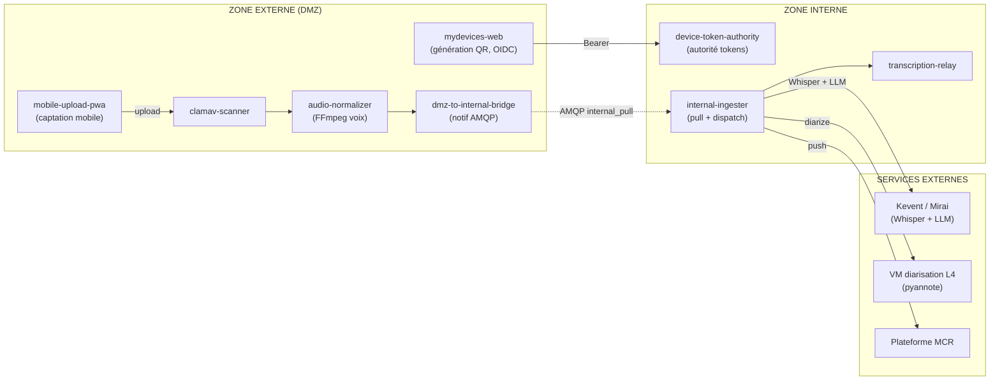

**Lecture rapide** :
- L'externe accueille les uploads, scanne et normalise.
- L'interne reçoit par PULL (queue AMQP + trigger HTTP optionnel) et orchestre transcription/diarisation/LLM.
- Les appels lourds (Whisper, pyannote, LLM) sortent vers des services externes mais sont initiés *depuis l'interne*.

### 3.3 Cycle complet d'un fichier

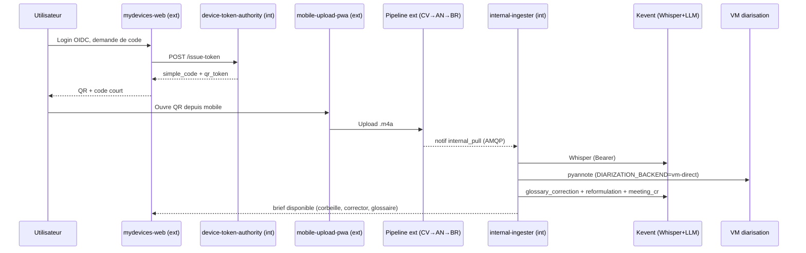

### 3.4 Les neuf services applicatifs

Tous les noms sont *self-explanatory* depuis le rebranding du 2026-05-16. Le format `nom (zone, port, rôle court)` :

| Service | Zone | Port | Rôle |
|---|---|---|---|
| **mydevices-web** | Externe | 8080 | Frontend OIDC, demande de tokens, suivi corbeille, édition glossaire, corrector de transcript |
| **mobile-upload-pwa** | Externe | 8081 | PWA installable mobile, captation audio, WebSocket |
| **admin-console** | Externe | 8082 | Suivi pipeline, S3 browser, métriques |
| **clamav-scanner** | Externe | — | Scan AV, quarantaine |
| **audio-normalizer** | Externe | — | FFmpeg voix (probe RMS + loudnorm dual-pass conditionnel) |
| **dmz-to-internal-bridge** | Externe | — | Publie `internal_pull` (AMQP, durable) + trigger HTTP optionnel |
| **device-token-authority** | **Interne** | 8091 | Autorité unique de frappe des codes d'upload |
| **internal-ingester** | Interne | 8090 | Drain queue + pull S3 + orchestrateur transcription/diarisation/LLM |
| **transcription-relay** | Interne | — | Backend `stub` (simulation par queue locale) |

---

## 4. Identité et SSO

| Environnement | Realm Keycloak | Client | Hostname |
|---|---|---|---|
| Docker Compose local | `openwebui` | `mes-reunions` | `http://localhost:8080` |
| Intégration interne | `openwebui` | `mes-reunions` | `https://import-audio.fake-domain.name` |
| Recette | `openwebui` | `mes-reunions` | (cf overlays kustomize recette) |
| Prod-bêta (cible) | `openwebui` | `mes-reunions` | `https://<mesreunions-host>` (canonique) + `https://<mydevices-host>` (transition) |

> Depuis le 2026-05-16 **tous les modes** utilisent le client `mes-reunions` sur le realm `openwebui`. Les noms historiques (`audio-upload-app` / realm `audio-upload`) ne sont plus utilisés.

Quand le `clientId` change, le secret K8s `oidc-secret` (gitignored) doit être patché sur le cluster — sinon le pod envoie l'ancien `client_id` et le login casse silencieusement (le cookie de session existant masque le problème).

---

## 5. Concepts à connaître avant de toucher au code

### 5.1 Le pattern PULL strict

Aucune donnée n'est *poussée* vers l'interne. La DMZ publie une notification sur la queue `internal_pull` ; l'interne ouvre une socket sortante vers le broker pour la consommer, puis tire le fichier depuis S3. Le trigger HTTP optionnel est purement une optimisation de latence (filtré par bearer + ACL nginx).

### 5.2 Le triple stockage S3

| Bucket | Localisation | Contenu | IAM |
|---|---|---|---|
| `audio-upload` | DMZ | Fichiers bruts, scannés en place | writer DMZ only |
| `audio-processed` | DMZ (guichet) | Fichiers transcodés, *guichet* vers l'interne | writer DMZ + reader interne |
| `audio-internal` | Interne | Comptes usagers, zone protégée | interne only |

### 5.3 Le selector de backend transcription

`TRANSCRIPTION_BACKEND ∈ {stub, mcr, kevent}` choisit l'orchestrateur post-pull. En prod-bêta interne : `kevent` (Whisper + LLM via gateway Mirai).

### 5.4 Le selector de backend diarisation

`DIARIZATION_BACKEND ∈ {kevent, vm-direct}` choisit le moteur pyannote. En prod-bêta interne depuis le 2026-05-17 : `vm-direct` à `http://<vm-diarization-host>:8080` (cf [docs/DIARIZATION_BACKEND.md](docs/DIARIZATION_BACKEND.md)).

### 5.5 La corbeille (soft-delete)

DELETE depuis mydevices = soft-delete via `trashed_at`. Auto-purge 30j déclenchée par `api_my_sessions`. **Aligner** `EXTERNAL_PURGE_MAX_AGE_HOURS=720` avec `TRASH_RETENTION_DAYS` sinon les items external sont purgés avant la corbeille.

### 5.6 La rétention device = source de vérité

Le `DEVICE_TOKEN_RETENTION_HOURS=360` (15j) pilote tout. La grâce QR (5 min) est un effet de bord. Le renew bump *les deux*. Cette variable doit être positionnée sur **token-issuer ET code-generator**.

### 5.7 Le glossaire utilisateur

La table `user_glossary_terms` stocke un glossaire *global* par `user_sub`. Il est :
- alimenté en upsert batch à chaque brief Mes Réunions ;
- lu par le `internal-ingester` pour **toutes** les transcriptions du même utilisateur (pas seulement audio↔brief liés) ;
- éditable depuis mydevices (CRUD via API) ;
- envoyé à Whisper via `initial_prompt` (~244 tokens max) + post-traité côté LLM via `glossary_correction` (stratégies complémentaires).

### 5.8 Le cycle meeting-prep

```
brief → auto-link audio (cosine ≥ 0.55 + écart ≥ 0.15)
     → reprocess avec glossaire amendé
     → chaînage série via series_parent_id
```

Caps glossaire : 50 (brief) / 200 (utilisateur) / 300 (combiné). 4 fichiers exportés au Drive + `glossaire-utilisateur.txt`.

### 5.9 Le corrector de transcript

Côté mydevices : édition des segments, marquage des termes glossaire (« ignorer », « toujours utiliser »), feedback structuré (`usefulness`, `regenerate`, `correction`). Les corrections segment-par-segment **n'utilisent plus** l'option « Relancer les étapes LLM » (depuis 2026-05-17) — un badge orange `pending-corrections` invite l'utilisateur à régénérer le compte-rendu en fin d'édition. Persisté en `localStorage` + base (table `user_feedback`).

---

## 6. Démarrage rapide (Docker Compose)

```bash
git clone https://github.com/votre-org/mirai-mesreunions.git
cd mirai-mesreunions
cp configs/.env.example configs/.env
bash deploy/scripts/setup.sh             # ou : docker compose -f deploy/docker/docker-compose.yml up -d
```

Accès :

| Service | URL | Identifiants de test (**ne JAMAIS utiliser en prod**) |
|---|---|---|
| mydevices-web | http://localhost:8080 | `testuser` / `testpassword` (OIDC) |
| mobile-upload-pwa | http://localhost:8081 | accès par code/QR |
| admin-console | http://localhost:8082 | `admin` / `adminpassword` (OIDC) |
| Keycloak admin | http://localhost:8180 | `admin` / `admin` |
| RabbitMQ | http://localhost:15672 | `audio` / `change-me-rabbit` |
| MinIO upload / processed / internal | :9001 / :9003 / :9005 | `minioadmin` / `minioadmin` |

**Test mobile sur LAN** : `PUBLIC_HOST=192.168.x.x docker compose ... up -d --build` (ou `deploy/scripts/compose-up.sh`).

**Compatibilité multi-arch** : `linux/amd64` et `linux/arm64`. Tous les images infra sont figées par digest pour la reproductibilité.

**Générer un token interne robuste** :
```bash
python -c "import secrets; print(secrets.token_urlsafe(32))"
```

**Créer des comptes Keycloak de test** :
```bash
cp deploy/kubernetes/scripts/create-keycloak-test-users.local.env.example \
   deploy/kubernetes/scripts/create-keycloak-test-users.local.env
# éditer les credentials admin
./deploy/kubernetes/scripts/create-keycloak-test-users.local.sh
# crée testuser01 → testuser10
```

---

## 7. Déploiement Kubernetes (prod-bêta)

> **Règle d'or** : *toujours* passer par kustomize, *jamais* `kubectl apply -f` directement sur les manifests `base/`.
>
> ```bash
> kustomize build --load-restrictor=LoadRestrictionsNone \
>   deploy/kubernetes/environments/prod-beta/internal/ \
>   | kubectl apply -f -
> ```
>
> Sinon ~15 env vars critiques (`TRANSCRIPTION_BACKEND=kevent`, `KEVENT_*_ENABLED`, `LITELLM_BASE_URL`, …) sont écrasées → pipeline cassé.

### 7.1 Pipeline de build prod-bêta

Le script `deploy/scripts/commit-push-build.sh` :
1. `git push`
2. `ssh root@<vm-diarization-host>` (cloud build VM)
3. `docker buildx build --platform linux/amd64`
4. `docker push` registry SCW
5. `kubectl set image` (rollout strategy `surge=100%` pour fast rollouts)

### 7.2 Cert-manager + DNS-01 (CNAME delegation)

Pattern N1 CDS : sous-zone dédiée `acme.<organisation-domain>` pour la délégation cert-manager.

Pour chaque nouvel hôte, créer dans la zone parente :
```
_acme-challenge.<host>   CNAME   _acme-challenge.<host>.acme.<organisation-domain>.
```

Sans ce CNAME, le challenge échoue avec `domain not found` (le webhook Scaleway ne gère que la sous-zone déléguée).

### 7.3 Autoscaling

| Workload | Type | Source |
|---|---|---|
| `audio-normalizer` | KEDA | queue `transcode` (≤ 50 replicas) |
| `dmz-to-internal-bridge` | KEDA | queue `file_ready` (≤ 50 replicas) |
| `transcription-relay` | KEDA | queue `transcription` (≤ 20 replicas) |
| `internal-ingester` | HPA | CPU/mémoire (1 → 20 replicas) |

### 7.4 Runbook debug transfert

```bash
# Santé
kubectl -n audio-external get pods
kubectl -n audio-internal get pods

# Autoscaling actif
kubectl -n audio-external get scaledobject
kubectl -n audio-internal get scaledobject hpa

# Chaîne de transfert
kubectl -n audio-external logs deploy/dmz-to-internal-bridge --tail=200
kubectl -n audio-internal logs deploy/internal-ingester     --tail=200

# Redémarrage ciblé
kubectl -n audio-external rollout restart deploy/dmz-to-internal-bridge
kubectl -n audio-internal rollout restart deploy/internal-ingester
```

À vérifier : `dmz-to-internal-bridge` publie sans erreur, `internal-ingester` répond `already_pulled` au rejeu (idempotence), secrets S3 cohérents entre namespaces.

### 7.5 Migration SQL avant rollout (sinon crash)

**Toujours** appliquer `ALTER TABLE` AVANT le rollout du service qui lit la colonne. Sinon SQLAlchemy retourne `UndefinedColumn` en boucle, et un re-rollout est requis après migration pour reset le pool de connexions.

---

## 8. Sécurité — les huit principes

1. **Tokens frappés en interne** — `device-token-authority` est seule autorité. En cas de compromission DMZ, aucun token frauduleux possible.
2. **PULL strict** — Aucune donnée poussée vers l'interne. AMQP sortant + S3 pull. Trigger HTTP optionnel = optimisation latence uniquement.
3. **Surface entrante interne minimale** — `device-token-authority:8091` réservé à `mydevices-web` via NetworkPolicy ; `internal-ingester` exposé uniquement via `pull-trigger.<organisation-domain>` (whitelist IP nginx + bearer + ACL applicative optionnelle).
4. **Triple S3 segmenté** — `audio-upload` / `audio-processed` (guichet) / `audio-internal`.
5. **Codes éphémères** — TTL configurable (15 min → 7 jours), quota uploads configurable (default 299).
6. **AV obligatoire** — ClamAV systématique, quarantaine sur infection.
7. **Idempotent** — Rejeu `file_ready` → `already_pulled`, pas de doublon.
8. **Enrôlement device persistant** — Token device en `localStorage`, validation fast-path + backend, révocation unitaire/globale.

---

## 9. Captures d'écran

QR Generator
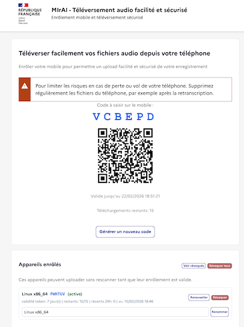
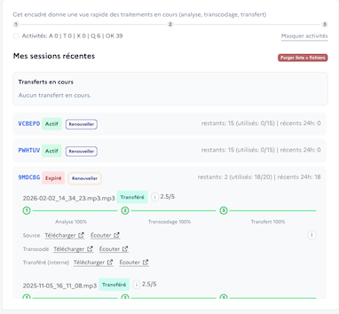

Upload mobile
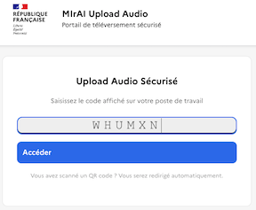
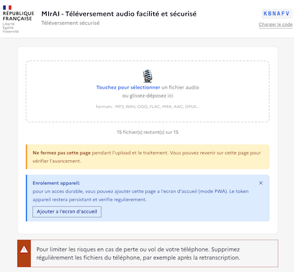
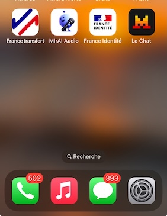
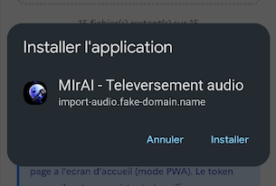
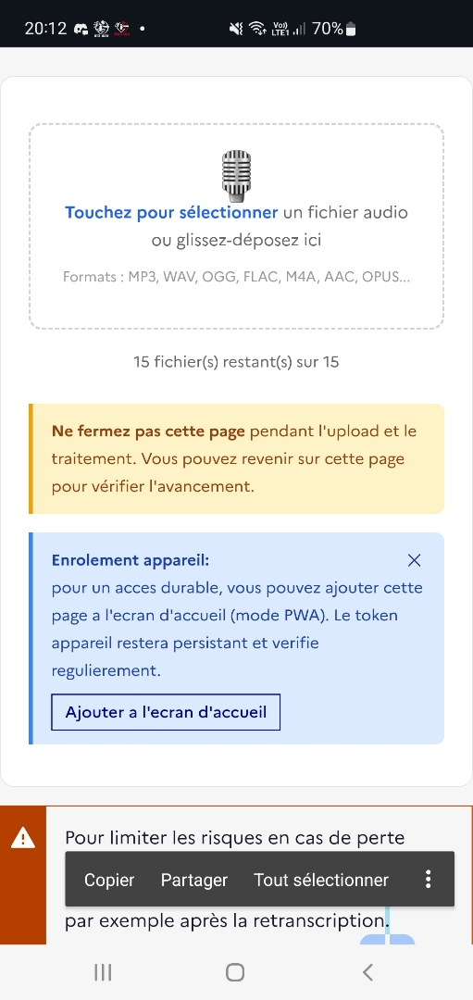
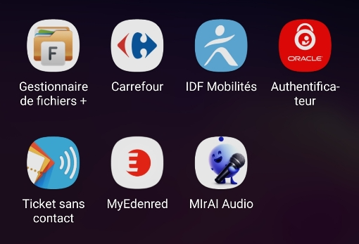

Admin
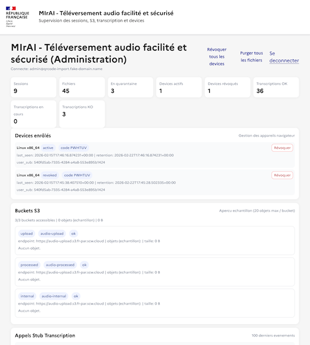

---

## 10. Référence — variables d'environnement

### 10.1 Codes et sessions

| Variable | Défaut | Description |
|---|---|---|
| `CODE_TTL_MINUTES` | `10080` | TTL par défaut (7j) |
| `CODE_TTL_MAX_MINUTES` | `10080` | TTL max |
| `ALLOW_SHORT_QR_TTL_SECONDS_TEST` | `false` | Autorise les TTL test `15s`/`30s` |
| `MAX_UPLOADS_PER_SESSION` | `299` | Quota uploads (plafond silencieux serveur) |
| `CODE_LENGTH` | `6` | Longueur du code simple |
| `UPLOAD_STATUS_VIEW_TTL_MINUTES` | `60` | Durée de consultation post-expiration |
| `UPLOAD_EXPIRY_GRACE_SECONDS` | `300` | Grâce pour terminer un upload en cours |

### 10.2 Devices

| Variable | Défaut | Description |
|---|---|---|
| `DEVICE_TOKEN_RETENTION_HOURS` | `168` | Rétention enrôlement (15j en prod = 360). **Source de vérité, à positionner sur token-issuer ET code-generator** |
| `DEVICE_REVALIDATE_INTERVAL_SECONDS` | `14400` | Intervalle revalidation asynchrone |
| `DEVICE_REVALIDATE_MAX_FAILURE_SECONDS` | `14400` | Fenêtre max d'échec avant refus |
| `DEVICE_API_PROXY_BASE_URL` | `http://mydevices-web:8080` | Proxy device |

### 10.3 Purges et corbeille

| Variable | Défaut | Description |
|---|---|---|
| `EXTERNAL_PURGE_INTERVAL_SECONDS` | `86400` | Fréquence purge upload portal |
| `EXTERNAL_PURGE_MAX_AGE_HOURS` | `12` (prod : `720`) | Âge max fichiers externes. **Aligner avec `TRASH_RETENTION_DAYS`** |
| `INTERNAL_PURGE_INTERVAL_SECONDS` | `86400` | Fréquence purge interne |
| `INTERNAL_PURGE_MAX_AGE_DAYS` | `7` | Âge max fichiers internes |
| `TRASH_RETENTION_DAYS` | `30` | Rétention soft-delete |

### 10.4 Trigger HTTP optionnel (PULL)

| Variable | Défaut | Description |
|---|---|---|
| `INTERNAL_PUSH_TRIGGER_URL` | `""` | Wake-up cross-cluster ; toute non-URL désactive |
| `INTERNAL_PUSH_TRIGGER_TOKEN` | — | Bearer dédié, rotable indépendamment d'`INTERNAL_API_TOKEN` |
| `INTERNAL_PUSH_TRIGGER_IP_ALLOWLIST` | `""` | ACL CIDR applicative (4e couche) |
| `INTERNAL_PULL_QUEUE_INTERVAL_SECONDS` | `30` | Drain périodique de la queue |
| `PULL_TRIGGER_HTTP_TIMEOUT_SECONDS` | `3` | Timeout du POST best-effort |
| `QUEUE_MAX_RETRIES` | `5` | Drop des messages poisons (header `x-retry-count`) |

### 10.5 Audio et normalisation

| Variable | Défaut | Description |
|---|---|---|
| `FFMPEG_AUDIO_FILTER` | `highpass=f=80,lowpass=f=7000,loudnorm=...` | Filtre voix |
| `ENABLE_LOUDNORM` | `true` | Active loudnorm dual-pass linear. Ignoré si `LOUDNORM_AUTO_DECISION=true` |
| `POST_LOUDNORM_FILTER_CHAIN` | `highpass=f=80,lowpass=f=7000,alimiter=limit=0.95` | Post-loudnorm (ordre strict) |
| `LOUDNORM_AUTO_DECISION` | `true` | Probe RMS : skip loudnorm si déjà au-dessus du seuil |
| `LOUDNORM_RMS_THRESHOLD_DBFS` | `-30.0` | Seuil de décision |
| `LOUDNORM_PROBE_OFFSETS_S` | `60,300` | Offsets de mesure |
| `LOUDNORM_PROBE_DURATION_S` | `5.0` | Durée fenêtre |
| `NORMALIZATION_CACHE_TTL_SECONDS` | `3600` | Cache métriques admin |
| `NORMALIZATION_MAX_COMPUTE_PER_REFRESH` | `0` | Max analyses par refresh (0 = non bloquant) |
| `NORMALIZATION_ANALYSIS_MAX_SECONDS` | `180` | Durée max échantillon analysé |

### 10.6 Backends transcription / diarisation

| Variable | Défaut | Description |
|---|---|---|
| `TRANSCRIPTION_BACKEND` | `stub` | `stub` (simulation), `mcr` (push MCR), `kevent` (Whisper+LLM Mirai) |
| `DIARIZATION_BACKEND` | `kevent` | `kevent` (via gateway) ou `vm-direct` (HTTP direct) |
| `DIARIZATION_VM_URL` | — | URL VM si backend `vm-direct` (ex `http://<vm-diarization-host>:8080`) |

### 10.7 Communs

| Variable | Défaut | Description |
|---|---|---|
| `TOKEN_ISSUER_API_URL` | `http://device-token-authority:8091/api/v1/issue-token` | URL device-token-authority |
| `INTERNAL_API_TOKEN` | — | Bearer partagé inter-zones (min 32 char, pas de placeholder) |
| `PUBLIC_HOST` | — | Hôte/IP publique pour QR + redirects |
| `OIDC_ISSUER` | — | URL Keycloak |
| `OIDC_INTERNAL_ISSUER` | `http://keycloak:8080/realms/openwebui` | URL Keycloak interne (serveur-à-serveur) |
| `OIDC_REDIRECT_URI` | — | URI code-generator (sans `/admin` !). admin-portal override via env inline |

---

## 11. Référence — pipeline audio

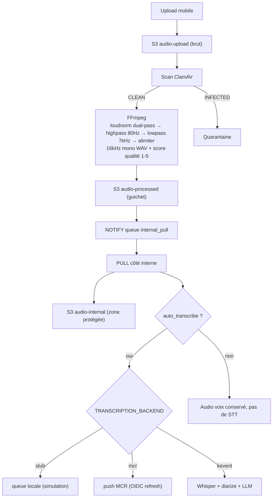

> **Formats supportés** : MP3, WAV, OGG, FLAC, M4A, AAC, WMA, OPUS, WEBM.

> **Roadmap V2 (sprint reliability)** — refonte du `_transcribe_via_kevent` monolithique en 9 step functions idempotentes (1 queue RabbitMQ par étape) avec fan-out parallèle post-whisper (`glossary`, `oob_cleaning`, `reformulation`, `meeting_cr` provisoire) puis `meeting_cr` final après `speaker_names`. Cible : TTFV ramené de ~25 min à ~5 min. Plan : `~/.claude/plans/federated-finding-whisper.md` et [docs/integrate-with-kevent.md#évolution-prévue--pipeline-v2-dag-composable-sprint-reliability](docs/integrate-with-kevent.md).

---

## 12. Référence — isolation réseau

### Docker Compose

| Réseau | Services | Rôle |
|---|---|---|
| `external-net` | mydevices-web, mobile-upload-pwa, admin-console, workers, ClamAV, MinIO upload/processed, PG ext | DMZ |
| `internal-net` | device-token-authority, internal-ingester, transcription-relay, admin-console, MinIO internal, PG int | Interne |
| `dmz-net` | mydevices-web ↔ device-token-authority, dmz-to-internal-bridge ↔ internal-ingester | Bridge contrôlé (2 flux) |

### Kubernetes

NetworkPolicies par namespace, deny-all par défaut côté interne, 2 exceptions :
1. `mydevices-web` → `device-token-authority:8091` (intra-cluster pour Docker Compose ; cross-cluster via egress contrôlé en K8s)
2. `dmz-to-internal-bridge` → `internal-ingester` (uniquement via Ingress `pull-trigger.<organisation-domain>`)

---

## 13. Tests et validation

| Cahier | Objet |
|---|---|
| [tests/DISCOVERY_TEST_PLAN.md](tests/DISCOVERY_TEST_PLAN.md) | Cahier humain bout-en-bout |
| [tests/TEST_COVERAGE_STATUS.md](tests/TEST_COVERAGE_STATUS.md) | Couverture / résultats |
| [tests/TEST_PLAN_DEVICE_ENROLLMENT.md](tests/TEST_PLAN_DEVICE_ENROLLMENT.md) | Enrôlement device |
| [tests/unit/test_device_token.py](tests/unit/test_device_token.py) | Unitaire token device |
| [tests/scenarios/device_enrollment_sequence.sh](tests/scenarios/device_enrollment_sequence.sh) | Scénario simulé |

**Scénario E2E** :
1. Générer un code via `https://import-audio.fake-domain.name` (ou `http://localhost:8080`).
2. Ouvrir le QR depuis mobile, uploader un audio court.
3. Vérifier progression : `uploaded` → `scanned` → `transcoded` → `transferred`.
4. Côté admin (`:8082`) : session présente avec ses événements.
5. Vérifier objets : `audio-upload` (brut) / `audio-processed` (transcodé) / `audio-internal` (transféré).
6. Vérifier transcription selon flag :
   - `auto_transcribe=true` → backend appelé, journal visible.
   - `auto_transcribe=false` → aucune file STT.

---

## 14. Mesure d'impact normalisation (outil local)

```bash
python deploy/scripts/measure_normalization_impact.py \
  --source /chemin/source.wav --normalized /chemin/normalise.wav [--json]
```

---

## 15. Arborescence du projet

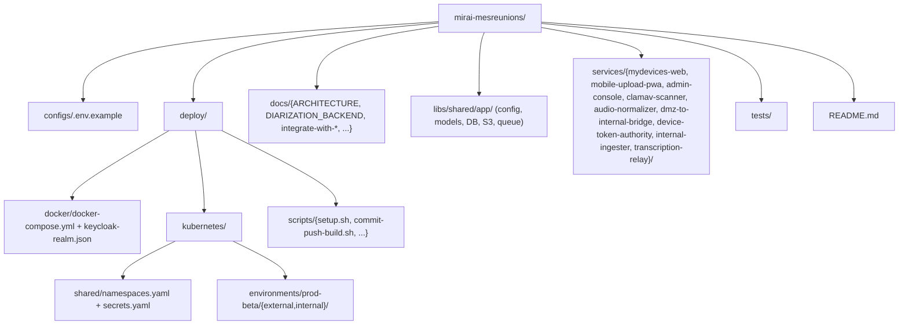

---

## 16. Licence

Apache-2.0
