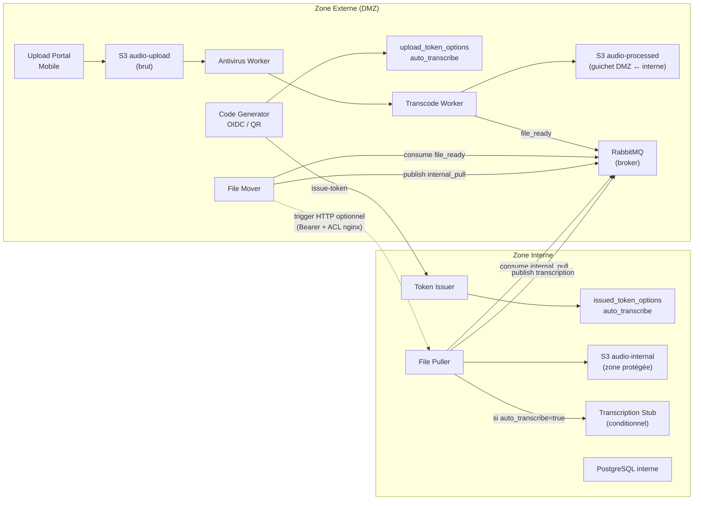
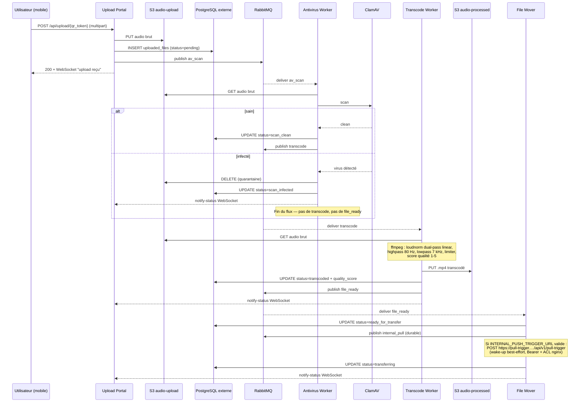
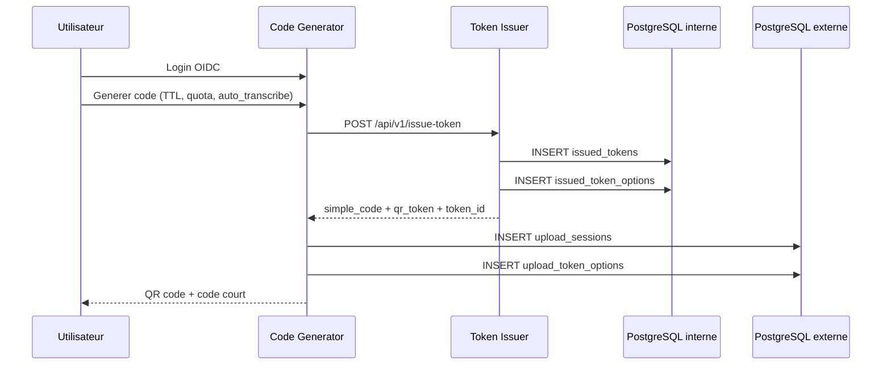
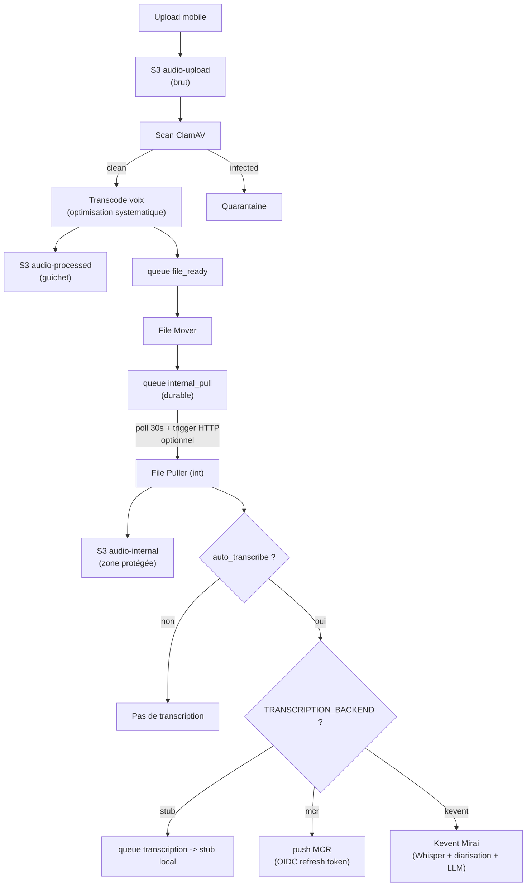
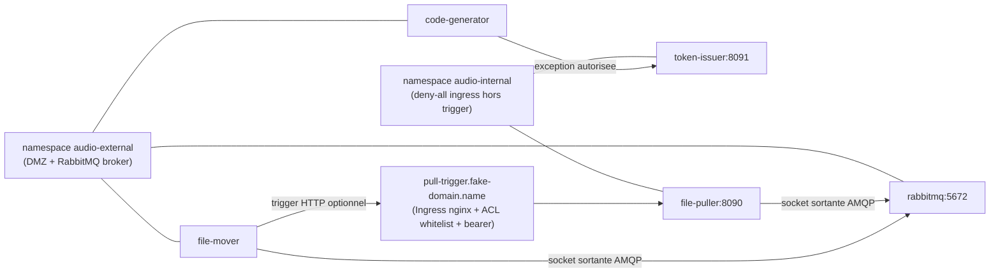

# Architecture & Securite

## Objectif

Le systeme applique un cloisonnement strict entre zone externe et zone interne pour proteger l'identite utilisateur, les tokens de session et les fichiers audio importes.

## Parcours De Lecture

1. `README.md` pour la vue d'ensemble et l'exploitation.
2. `docs/ARCHITECTURE.md` (ce fichier) pour les flux de securite.
3. `tests/DISCOVERY_TEST_PLAN.md` pour la validation utilisateur.
4. `tests/TEST_COVERAGE_STATUS.md` pour le statut de couverture.

## Architecture Logique



> Le broker RabbitMQ vit côté DMZ (namespace `audio-external`). La zone
> interne ouvre une socket **sortante** vers ce broker pour publier *et*
> consommer ses queues — aucune connexion entrante ne traverse la frontière.
> Le **trigger HTTP optionnel** (flèche pointillée) est un wake-up
> best-effort pour ramener la latence en dessous du tick de polling ; il
> est désactivé par défaut et activé seulement si
> `INTERNAL_PUSH_TRIGGER_URL` parse comme URL HTTP(S) valide.

## Flux DMZ — Réception et préparation

Détail du parcours d'un fichier *à l'intérieur* de la zone externe, du
moment où l'utilisateur l'envoie jusqu'à ce que la zone interne soit
sollicitée. Toutes les flèches restent dans le namespace `audio-external` ;
la suite (consume `internal_pull` côté interne, copie S3 cross-zone) est
dans la section *Pattern PULL Inter-Zones* qui suit.



> Trois propriétés clés du flux DMZ :
> - **Aucune écriture directe sur la zone interne** — uniquement des
>   publications AMQP sur le broker DMZ (et un wake-up HTTP optionnel) ;
>   la zone interne consommera ces messages plus tard à son rythme.
> - **Découplage par queue à chaque étape** (`av_scan` → `transcode` →
>   `file_ready` → `internal_pull`) — chaque worker est arrêtable
>   indépendamment, et le retry counter (PR #2) drop les messages
>   poisons après `QUEUE_MAX_RETRIES=5` au lieu de bloquer la queue.
> - **WebSocket temps réel** vers l'upload-portal pour que l'utilisateur
>   voie l'avancement (scan → transcodé → transfert) sans recharger.

## Pattern PULL Inter-Zones

```mermaid
sequenceDiagram
  participant FM as File Mover (ext)
  participant MQ as RabbitMQ (ext)
  participant FP as File Puller (int)
  participant S3P as S3 audio-processed
  participant S3I as S3 audio-internal
  participant PGI as PostgreSQL interne
  participant STT as Transcription Stub (int)

  FM->>MQ: publish internal_pull (metadata)
  opt INTERNAL_PUSH_TRIGGER_URL valide
    FM->>FP: POST /api/v1/pull-trigger (wake-up best-effort, bearer)
  end
  loop chaque INTERNAL_PULL_QUEUE_INTERVAL_SECONDS (30 s par défaut)
    FP->>MQ: basic.get internal_pull
  end

  Note over FP,PGI: Intégration du fichier au compte utilisateur — toujours, indépendamment d'auto_transcribe
  FP->>S3P: télécharge le fichier .mp4 transcodé
  FP->>S3I: dépose dans le bucket interne
  FP->>PGI: INSERT user_audio_files (transcription_status=pending|disabled)

  opt auto_transcribe = true
    Note over FP,STT: La queue n'est pas un simple relai : elle sert de buffer durable<br/>(survit à un crash du stub), de filet retry borné via x-retry-count<br/>(audio corrompu = drop après 5 tentatives), et de signal scaling KEDA<br/>(transcription-stub-scaledobject autoscale sur la profondeur de queue).
    FP->>MQ: publish transcription (audio_file_id, stored_filename)
    MQ-->>STT: deliver transcription
    STT->>S3I: GET audio (stored_filename)
    Note over STT: backend `stub` par défaut (délai simulé) ;<br/>backends `mcr` et `kevent` court-circuitent la queue<br/>(cf docs/integrate-with-{mcr,kevent}.md)
    STT->>PGI: UPDATE user_audio_files<br/>transcription_status=processing → completed
    STT->>PGI: stocke transcription_text
    STT->>PGI: INSERT transcription_events (audit)
  end
```

> **Trois mécanismes empilés**, du plus durable au plus rapide :
> 1. **Queue durable `internal_pull`** : source de vérité, persiste sur
>    disque, rattrapée automatiquement après une indispo de la zone interne.
> 2. **Polling périodique côté interne** (30 s par défaut) : filet permanent
>    qui draine la queue indépendamment du trigger HTTP.
> 3. **Trigger HTTP optionnel** : wake-up pour ramener la latence quasi-zéro.
>    Activé uniquement si `INTERNAL_PUSH_TRIGGER_URL` parse en URL HTTP(S)
>    valide ; toute valeur non-URL (`""`, `deactivate`, `false`, etc.)
>    désactive le trigger sans perte fonctionnelle.

## Flux Generation Token



## Pipeline Audio



> **3 backends mutuellement exclusifs** sélectionnés via `TRANSCRIPTION_BACKEND` :
> `stub` (défaut, simulation), `mcr` (push vers la plateforme MCR cf
> [docs/integrate-with-mcr.md](integrate-with-mcr.md)), `kevent` (transcription
> Whisper + pyannote + intelligence de réunion LLM cf
> [docs/integrate-with-kevent.md](integrate-with-kevent.md)).

## Reseau Et Politiques



> Aucune connexion HTTP entrante n'atteint la zone interne sans passer par
> l'Ingress `pull-trigger`, qui filtre par IP source (annotation
> `whitelist-source-range`) puis exige un bearer applicatif distinct du
> `INTERNAL_API_TOKEN`. Le canal de notification fonctionne aussi sans cet
> Ingress, via la queue AMQP — la zone interne ouvre alors la seule socket
> qui traverse la frontière, dans le sens sortant.

## Pull-Trigger HTTP optionnel

Pour ramener la latence du flux vers la zone interne en dessous du tick
de polling (30 s par défaut), le file-mover peut envoyer un wake-up HTTP
au file-puller via un Ingress public dédié. Le mécanisme est conçu pour
être **désactivable et inopérant par défaut** :

- côté file-mover, l'env var `INTERNAL_PUSH_TRIGGER_URL` doit parser comme
  URL HTTP(S) valide pour activer le trigger ; toute autre valeur (vide,
  `false`, `deactivate`, `off`, mal formée) le désactive sans erreur ;
- côté file-puller, l'endpoint `/api/v1/pull-trigger` n'accepte que le
  bearer `INTERNAL_PUSH_TRIGGER_TOKEN` — distinct du `INTERNAL_API_TOKEN`
  pour permettre une rotation indépendante. Si le secret n'est pas
  provisionné, l'endpoint rejette toutes les requêtes en 401 ;
- l'Ingress nginx ajoute une 3e couche : `whitelist-source-range` filtre
  par IP source au niveau nginx (403 avant Flask) ; une 4e couche optionnelle
  `INTERNAL_PUSH_TRIGGER_IP_ALLOWLIST` côté Flask rend la défense en
  profondeur encore plus stricte sans changement Ingress.

**Rotation du token** : `openssl rand -hex 32` puis `kubectl apply` du Secret
`internal-push-trigger-secret` sur les deux clusters (audio-external pour
file-mover, audio-internal pour file-puller), suivi d'un rolling restart
des deux Deployments. Les anciens pods sur l'ancien token reçoivent 401 et
basculent silencieusement sur le polling AMQP sans perte de message —
c'est le bon comportement.

## Modeles De Donnees Utiles

- Zone interne:
  - `issued_tokens` (source de verite des tokens)
  - `issued_token_options` (flag `auto_transcribe`)
- Zone externe:
  - `upload_sessions` (suivi d'usage et statut)
  - `upload_token_options` (copie flag `auto_transcribe`)

## Comportement Du Flag auto_transcribe

- Valeur fixee a la creation du token via la checkbox QR.
- Propagee jusqu'a `file-puller` via metadata NOTIFY.
- Effet:
  - `true`: la transcription est mise en file (stub).
  - `false`: pas de mise en file transcription.
- Dans tous les cas, l'audio est optimise pour la voix (antivirus + transcodage).

## Captures Associees

- QR generator: `docs/screenshots/qr-code-gen.png`
- Suivi activite: `docs/screenshots/activity-follow.png`
- Upload mobile: `docs/screenshots/upload-mobile.png`
- Admin: `docs/screenshots/admin-panel.png`
