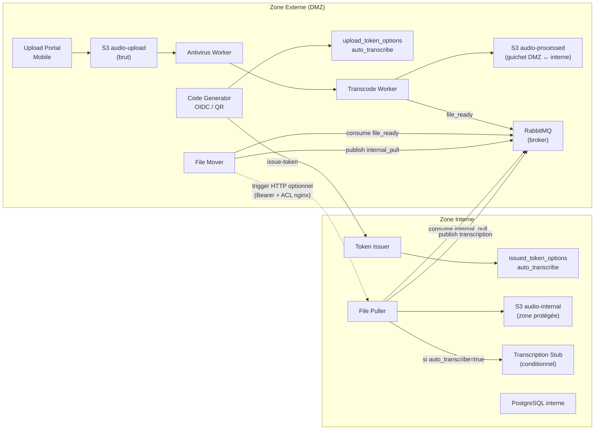
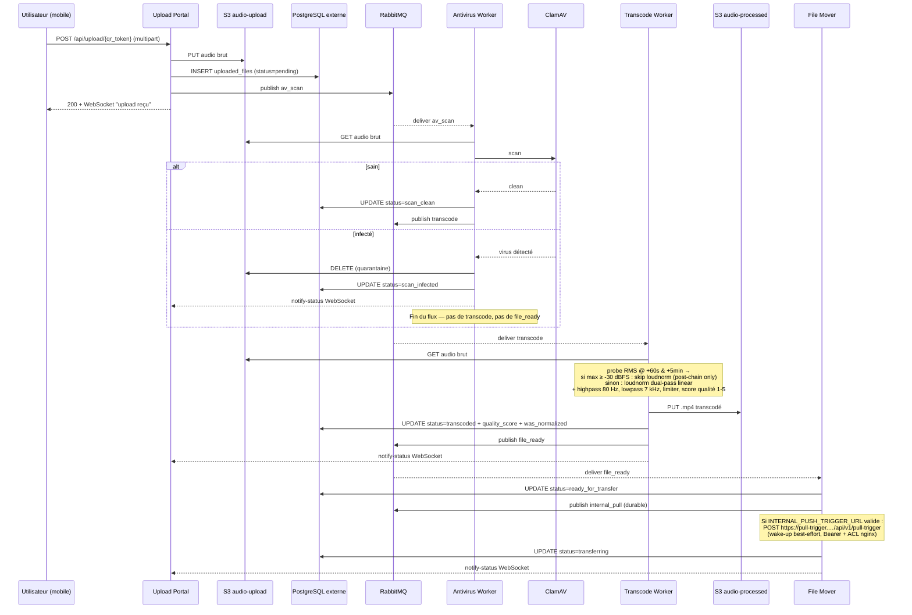
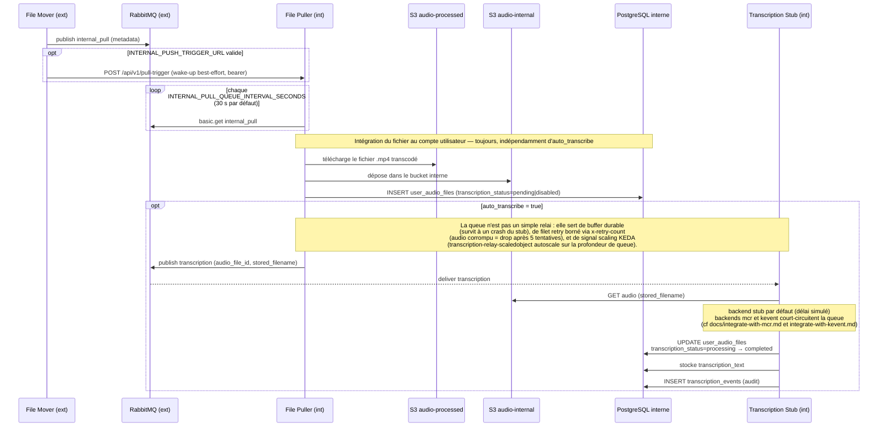
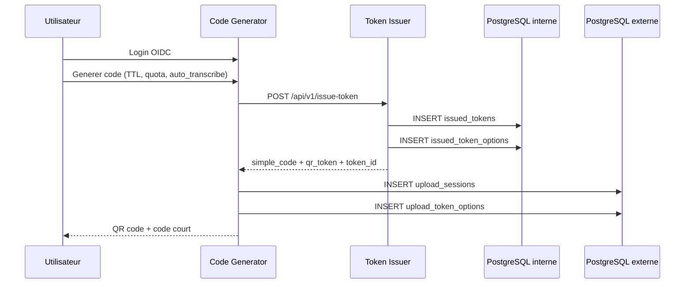
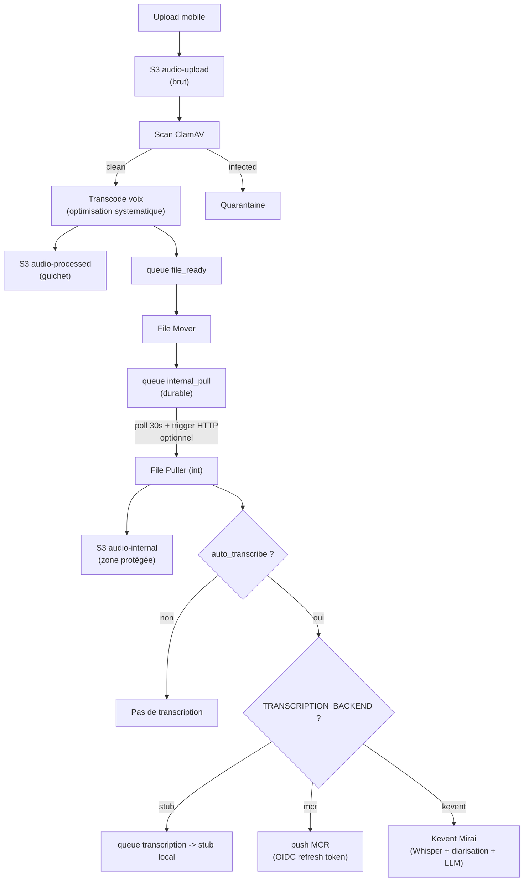
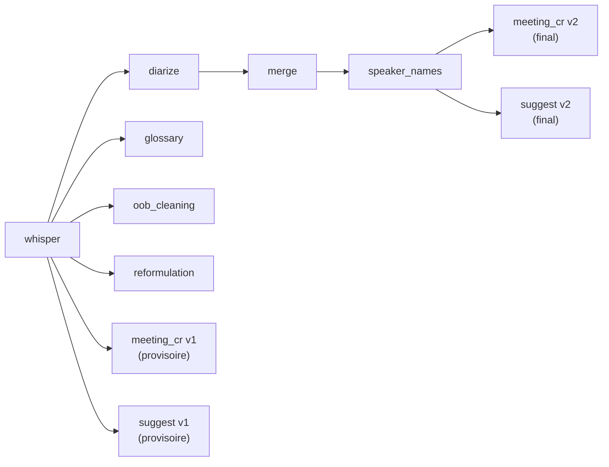
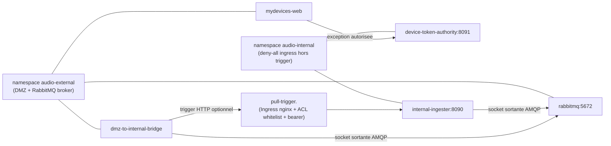

# Architecture & Securite

## Objectif

Le systeme applique un cloisonnement strict entre zone externe et zone interne pour proteger l'identite utilisateur, les tokens de session et les fichiers audio importes.

## Identité SSO Keycloak

Depuis le 2026-05-16, **tous les modes** de déploiement (Docker Compose,
intégration, recette, prod-bêta) utilisent le client Keycloak
`mes-reunions` sur le realm `openwebui`. Les anciens noms
`audio-upload-app` (client) et `audio-upload` (realm) ne sont plus
utilisés et doivent disparaître de tout nouveau manifeste.

| Environnement | Hostname public |
| --- | --- |
| Docker Compose local | `localhost:8080` |
| Intégration | `import-audio.fake-domain.name` |
| Prod-bêta canonique | `<mesreunions-host>` |
| Prod-bêta transition | `<mydevices-host>` |

> **Note critique** — quand le `clientId` change côté Keycloak (ou
> qu'un nouveau client est créé), il faut **aussi** patcher le Secret
> Kubernetes `oidc-secret` (gitignored, géré séparément du realm
> export). Sinon le pod continue d'envoyer l'ancien `client_id` et le
> login casse silencieusement — un cookie de session existant peut
> masquer le bug pendant plusieurs minutes.

## Parcours De Lecture

1. `README.md` pour la vue d'ensemble et l'exploitation.
2. `docs/ARCHITECTURE.md` (ce fichier) pour les flux de securite.
3. `tests/DISCOVERY_TEST_PLAN.md` pour la validation utilisateur.
4. `tests/TEST_COVERAGE_STATUS.md` pour le statut de couverture.

## Architecture Logique



> Le broker RabbitMQ vit côté DMZ (namespace `audio-external`). La zone
> interne ouvre une socket **sortante** vers ce broker pour publier *et*
> consommer ses queues — aucune connexion entrante ne traverse la frontière.
> Le **trigger HTTP optionnel** (flèche pointillée) est un wake-up
> best-effort pour ramener la latence en dessous du tick de polling ; il
> est désactivé par défaut et activé seulement si
> `INTERNAL_PUSH_TRIGGER_URL` parse comme URL HTTP(S) valide.

## Flux DMZ — Réception et préparation

Détail du parcours d'un fichier *à l'intérieur* de la zone externe, du
moment où l'utilisateur l'envoie jusqu'à ce que la zone interne soit
sollicitée. Toutes les flèches restent dans le namespace `audio-external` ;
la suite (consume `internal_pull` côté interne, copie S3 cross-zone) est
dans la section *Pattern PULL Inter-Zones* qui suit.



> Trois propriétés clés du flux DMZ :
> - **Aucune écriture directe sur la zone interne** — uniquement des
>   publications AMQP sur le broker DMZ (et un wake-up HTTP optionnel) ;
>   la zone interne consommera ces messages plus tard à son rythme.
> - **Découplage par queue à chaque étape** (`av_scan` → `transcode` →
>   `file_ready` → `internal_pull`) — chaque worker est arrêtable
>   indépendamment, et le retry counter (PR #2) drop les messages
>   poisons après `QUEUE_MAX_RETRIES=5` au lieu de bloquer la queue.
> - **WebSocket temps réel** vers l'mobile-upload-pwa pour que l'utilisateur
>   voie l'avancement (scan → transcodé → transfert) sans recharger.

## Pattern PULL Inter-Zones



> **Trois mécanismes empilés**, du plus durable au plus rapide :
> 1. **Queue durable `internal_pull`** : source de vérité, persiste sur
>    disque, rattrapée automatiquement après une indispo de la zone interne.
> 2. **Polling périodique côté interne** (30 s par défaut) : filet permanent
>    qui draine la queue indépendamment du trigger HTTP.
> 3. **Trigger HTTP optionnel** : wake-up pour ramener la latence quasi-zéro.
>    Activé uniquement si `INTERNAL_PUSH_TRIGGER_URL` parse en URL HTTP(S)
>    valide ; toute valeur non-URL (`""`, `deactivate`, `false`, etc.)
>    désactive le trigger sans perte fonctionnelle.

## Flux Generation Token



## Pipeline Audio



> **3 backends mutuellement exclusifs** sélectionnés via `TRANSCRIPTION_BACKEND` :
> `stub` (défaut, simulation), `mcr` (push vers la plateforme MCR cf
> [docs/integrate-with-mcr.md](integrate-with-mcr.md)), `kevent` (transcription
> Whisper + pyannote + intelligence de réunion LLM cf
> [docs/integrate-with-kevent.md](integrate-with-kevent.md)).

### Backend selector diarisation

Le backend `kevent` route désormais la diarisation via un sélecteur
runtime indépendant de la transcription Whisper :

- `DIARIZATION_BACKEND ∈ {kevent, vm-direct}` — choisit la cible
  d'appel pyannote.
- `DIARIZATION_VM_URL` — endpoint utilisé quand le backend vaut
  `vm-direct` (ex. `http://<vm-diarization-host>:8080`).

Depuis le 2026-05-17, **prod-bêta interne tourne sur `vm-direct`**
(VM L4 dédiée) pour contourner les limites TTL/timeout de la gateway
Kevent sur les longs audios. Voir
[docs/DIARIZATION_BACKEND.md](DIARIZATION_BACKEND.md).

**Baselines RTF observées** (Real-Time Factor, plus bas = plus rapide) :

| Plateforme | RTF |
| --- | --- |
| VM L4 directe | 0.027 |
| MIG10 prod (Kevent) | 0.060 |
| MIG20 prod (Kevent) | 0.097 |

### Pipeline watchdog (résilience auto)

Depuis le 2026-05-22, chaque pod `internal-ingester` lance au boot un
thread daemon `pipeline_watchdog` qui scan toutes les 30 s la table
`user_audio_files` pour repérer les rows orphelines :

- `transcription_status ∈ {pending, transferring, transcoding,
  kevent_queued, kevent_transcribing, kevent_processing}`
- ET `last_activity_at < NOW() - 5 min`

Pour chaque candidat, un **claim atomique** via `UPDATE … SET
pipeline_claim_at = NOW(), pipeline_claim_pod = $HOSTNAME WHERE id = $id
AND (pipeline_claim_at IS NULL OR < NOW() - 90s)` désigne un pod
gestionnaire unique (race-safe). Le pod claim appelle ensuite
`_reset_and_resubmit_kevent_pipeline` qui réutilise le moteur de
`POST /api/v1/audio/<id>/full-reprocess` : reset des colonnes pipeline,
download S3 interne, nouveau Kevent submit, LLM chain.

Couvre : pod tué (OOM, rollout, scale-down) en plein traitement,
poll Kevent crashé silencieusement, race window submission→DB perdue,
transitoire réseau. **Lease 90 s** : si le pod qui claim meurt avant
le resubmit, un autre pod prend la relève au tick suivant.

Schéma (migration 018) :
- `last_activity_at` TIMESTAMPTZ — heartbeat, touché par `_set_user_audio_status`
- `pipeline_claim_at` TIMESTAMPTZ + `pipeline_claim_pod` VARCHAR(128) — lease
- Index `ix_user_audio_watchdog (transcription_status, last_activity_at)`

Déclenchement manuel : `POST /api/v1/pipeline/resume-stuck-jobs`
(scope global = admin, ou body `{user_sub}` pour user-scope). Bouton
« 🔄 Relancer les bloqués » dans le header de la liste réunions
mesreunions-web. Code : [services/dmz-to-internal-bridge/app/pipeline_watchdog.py](../services/dmz-to-internal-bridge/app/pipeline_watchdog.py).

Tunables env : `PIPELINE_WATCHDOG_INTERVAL_S` (30), `PIPELINE_STALE_THRESHOLD_S` (300), `PIPELINE_CLAIM_LEASE_S` (90), `PIPELINE_MAX_AGE_HOURS` (24), `PIPELINE_WATCHDOG_DISABLED=1` (kill switch).

### Évolution prévue — Pipeline V2 backend Kevent (DAG composable)

**Statut : planifié, non implémenté** (cf. `~/.claude/plans/federated-finding-whisper.md`).

Le backend `kevent` actuel exécute le pipeline post-pull dans une
fonction monolithique `_transcribe_via_kevent` qui bloque un thread
internal-ingester 15-30 min et perd l'état au moindre rollout / OOM. La
refonte cible découpe ce monolithe en **9 step functions idempotentes**
pilotées chacune par sa propre queue RabbitMQ, avec un **fan-out
parallèle post-whisper** :



Bénéfice principal : TTFV (temps avant 1er compte-rendu utile) passe
de ~25 min à ~5 min, en affichant en UI un compte-rendu provisoire
sans locuteurs pendant que pyannote tourne. Détail complet dans
[docs/integrate-with-kevent.md](integrate-with-kevent.md#évolution-prévue--pipeline-v2-dag-composable-sprint-reliability).

## Reseau Et Politiques



> Aucune connexion HTTP entrante n'atteint la zone interne sans passer par
> l'Ingress `pull-trigger`, qui filtre par IP source (annotation
> `whitelist-source-range`) puis exige un bearer applicatif distinct du
> `INTERNAL_API_TOKEN`. Le canal de notification fonctionne aussi sans cet
> Ingress, via la queue AMQP — la zone interne ouvre alors la seule socket
> qui traverse la frontière, dans le sens sortant.

### Pièges connus

- **State in-memory + multi-replicas** : `mesreunions-web` tourne en
  2+ replicas en prod-bêta. Tout state stocké en mémoire de processus
  (dict Python, cache local, etc.) est perdu ~50 % des polls à cause
  du round-robin ClusterIP. Toute donnée qui doit survivre à plusieurs
  requêtes consécutives doit être persistée (DB ou Redis) ou bien le
  Service doit activer `sessionAffinity: ClientIP`.

- **SCW LB inter-cluster — résolu 2026-05-18 03:30**. Avant ce fix, les
  connexions depuis `internal-gw` vers `postgres-external-lb` et
  `rabbitmq-lb` échouaient ~50 % du temps en `server closed the
  connection unexpectedly`. **Cause** : la whitelist ACL
  `cds-allow-internal-cluster-only` sur ces LBs ne contenait que
  `<scw-pgw-external-gw-ip>` (l'IP du Public Gateway dédié au cluster
  **external-gw**, `pgw-k8s-cluster-1`) — manquait `<scw-pgw-internal-gw-ip>` (l'IP
  du Public Gateway dédié au cluster **internal-gw**,
  `pgw-k8s-cluster-2`). Quand internal-gw sortait via son propre PGW
  (push_default_route=true), l'ACL deniait. **Fix** : ajout de
  `<scw-pgw-internal-gw-ip>` aux 2 whitelists ACL. Sécurité maintenue : les 2 LBs
  ont une IP publique mais l'ACL les protège (laptop hors VPC ne peut
  pas se connecter — TCP RST). Doc complète : [docs/BUG_SCW_LB_INTER_CLUSTER.md](BUG_SCW_LB_INTER_CLUSTER.md).
  Filet applicatif `with_db_retry` toujours en place dans
  `libs/shared/app/database.py` (safety net défensif).

### Pattern CNAME delegation cert-manager

Pour chaque nouvel hôte exposé via cert-manager + webhook Scaleway,
créer dans la zone parente le CNAME :

```
_acme-challenge.<host>  CNAME  _acme-challenge.<host>.acme.<organisation-domain>.
```

Sans ce CNAME, le challenge DNS-01 échoue avec « domain not found » :
le webhook Scaleway ne sait répondre que dans la sous-zone déléguée
`acme.<organisation-domain>`. Toute nouvelle entrée d'Ingress avec
TLS automatique doit être précédée de ce CNAME côté DNS parent.

## Déploiement Kubernetes

**Règle d'or** — passer **toujours** par l'overlay kustomize de
l'environnement cible :

```bash
kustomize build --load-restrictor=LoadRestrictionsNone \
  deploy/kubernetes/environments/prod-beta/internal/ \
  | kubectl apply -f -
```

**JAMAIS** `kubectl apply -f` directement sur les manifests base.
Sinon ~15 variables d'environnement critiques (`TRANSCRIPTION_BACKEND=kevent`,
`KEVENT_*_ENABLED`, `LITELLM_BASE_URL`, `DIARIZATION_BACKEND`,
`DIARIZATION_VM_URL`, etc.) injectées uniquement par l'overlay sont
écrasées par les valeurs de base, et le pipeline de transcription
casse silencieusement (le pod démarre, mais route vers le stub local).

## Pull-Trigger HTTP optionnel

Pour ramener la latence du flux vers la zone interne en dessous du tick
de polling (30 s par défaut), le dmz-to-internal-bridge peut envoyer un wake-up HTTP
au internal-ingester via un Ingress public dédié. Le mécanisme est conçu pour
être **désactivable et inopérant par défaut** :

- côté dmz-to-internal-bridge, l'env var `INTERNAL_PUSH_TRIGGER_URL` doit parser comme
  URL HTTP(S) valide pour activer le trigger ; toute autre valeur (vide,
  `false`, `deactivate`, `off`, mal formée) le désactive sans erreur ;
- côté internal-ingester, l'endpoint `/api/v1/pull-trigger` n'accepte que le
  bearer `INTERNAL_PUSH_TRIGGER_TOKEN` — distinct du `INTERNAL_API_TOKEN`
  pour permettre une rotation indépendante. Si le secret n'est pas
  provisionné, l'endpoint rejette toutes les requêtes en 401 ;
- l'Ingress nginx ajoute une 3e couche : `whitelist-source-range` filtre
  par IP source au niveau nginx (403 avant Flask) ; une 4e couche optionnelle
  `INTERNAL_PUSH_TRIGGER_IP_ALLOWLIST` côté Flask rend la défense en
  profondeur encore plus stricte sans changement Ingress.

**Rotation du token** : `openssl rand -hex 32` puis `kubectl apply` du Secret
`internal-push-trigger-secret` sur les deux clusters (audio-external pour
dmz-to-internal-bridge, audio-internal pour internal-ingester), suivi d'un rolling restart
des deux Deployments. Les anciens pods sur l'ancien token reçoivent 401 et
basculent silencieusement sur le polling AMQP sans perte de message —
c'est le bon comportement.

## Cycle Meeting-Prep

Boucle de préparation et d'enrichissement des réunions :

1. **Brief** — l'utilisateur rédige un brief (contexte + participants
   + glossaire ad hoc) côté `mydevices-web`.
2. **Auto-link audio** — à chaque nouvel upload, le système calcule
   une similarité cosinus brief↔transcription et lie automatiquement
   si `cosine ≥ 0.55` **et** écart avec le 2e candidat `≥ 0.15`.
   Pas de boucle « suggestion + confirmation » utilisateur.
3. **Reprocess** — si le glossaire du brief est amendé après la
   transcription, le pipeline rejoue les étapes LLM (glossary
   correction + reformulation + compte-rendu) avec le glossaire à
   jour.
4. **Chaînage série** — une réunion peut référencer un parent via
   `series_parent_id` (suite d'une série), ce qui propage le brief et
   le glossaire de la session précédente.

**Caps glossaire** (anti-débordement contexte LLM) :

| Source | Cap |
| --- | --- |
| Brief courant | 50 termes |
| Glossaire utilisateur global | 200 termes |
| Combiné (passé au LLM) | 300 termes |

**Export Drive** — 4 fichiers par réunion + `glossaire-utilisateur.txt`
au niveau racine utilisateur. Persistance Drive en **best-effort
async overwrite** : la DB reste la source de vérité, le champ
`drive_sync_status` trace les échecs sans bloquer l'UX. Soft-delete
DB → trash Drive (corbeille Drive, pas suppression définitive).

## Corrector De Transcript & Feedback Utilisateur

Édition segment-par-segment de la transcription côté `mydevices-web`,
avec table `user_feedback` (migration 015) typée :

- `usefulness` — note de pertinence globale du compte-rendu ;
- `regenerate` — demande explicite de relancer les étapes LLM ;
- `correction` — correctif local sur un segment.

Depuis le 2026-05-17, la popup de correction n'expose **plus**
l'option « Relancer les étapes LLM » à chaque édit. À la place, un
badge `pending-corrections` (orange, persisté à la fois en
`localStorage` et en base) invite l'utilisateur à régénérer le
compte-rendu en fin de session d'édition — moins d'appels LLM
redondants, meilleure UX.

**Distinction critique des identifiants** : le `file_id` externe
(`uploaded_files.id`, zone DMZ) ≠ `audio.id` interne
(`user_audio_files.id`, zone interne). Le proxy `mydevices-web` fait
la résolution via `_resolve_internal_audio_id` qui chaîne
`get_owned_file` (vérif propriété DMZ) puis `lookup_audio_outputs`
(mapping vers l'ID interne). Toute nouvelle route corrector / feedback
doit passer par ce helper.

## Corbeille (Soft-Delete)

Un DELETE côté `mydevices-web` ne supprime jamais immédiatement : il
positionne `trashed_at` (soft-delete) sur la session et les fichiers
liés. L'auto-purge à 30 jours est déclenchée paresseusement par
`api_my_sessions` (premier appel après expiration).

> **Aligner** `EXTERNAL_PURGE_MAX_AGE_HOURS=720` avec
> `TRASH_RETENTION_DAYS=30` (720 h = 30 j). Si la purge externe tombe
> en deçà, les items externes disparaissent du S3 / DB DMZ **avant**
> d'apparaître dans la corbeille, ce qui rend la restauration
> impossible.

## Modeles De Donnees Utiles

- Zone interne:
  - `issued_tokens` (source de verite des tokens)
  - `issued_token_options` (flag `auto_transcribe`)
- Zone externe:
  - `upload_sessions` (suivi d'usage et statut)
  - `upload_token_options` (copie flag `auto_transcribe`)

### Glossaire utilisateur — `user_glossary_terms`

Table **globale par `user_sub`** (zone interne), upsertée en batch à
chaque brief meeting-prep. Elle est lue par `internal-ingester` pour
**toutes** les transcriptions du même utilisateur — pas seulement
celles liées à un brief. Le pipeline LLM combine ce glossaire global
avec celui éventuel du brief courant (caps 200 / 50 / 300, cf. cycle
meeting-prep).

**Stratégie complémentaire** côté transcription :

- Whisper `initial_prompt` (limite stricte ~244 tokens) — termes les
  plus discriminants en priorité ;
- LLM `glossary_correction` en post-traitement — exploite l'intégralité
  du glossaire combiné, indépendamment du cap Whisper.

### Migration SQL avant rollout

Toujours appliquer un `ALTER TABLE` **AVANT** le rollout du service
qui lira la colonne. Sinon SQLAlchemy retourne `UndefinedColumn` en
boucle (le metadata est figé au démarrage), et un **second rollout**
est nécessaire après la migration pour réinitialiser le pool de
connexions, doublant la fenêtre d'indispo.

## Comportement Du Flag auto_transcribe

- Valeur fixee a la creation du token via la checkbox QR.
- Propagee jusqu'a `internal-ingester` via metadata NOTIFY.
- Effet:
  - `true`: la transcription est mise en file (stub).
  - `false`: pas de mise en file transcription.
- Dans tous les cas, l'audio est optimise pour la voix (antivirus + transcodage).

## Captures Associees

Voir la section « Captures d'écran » du `README.md`.
