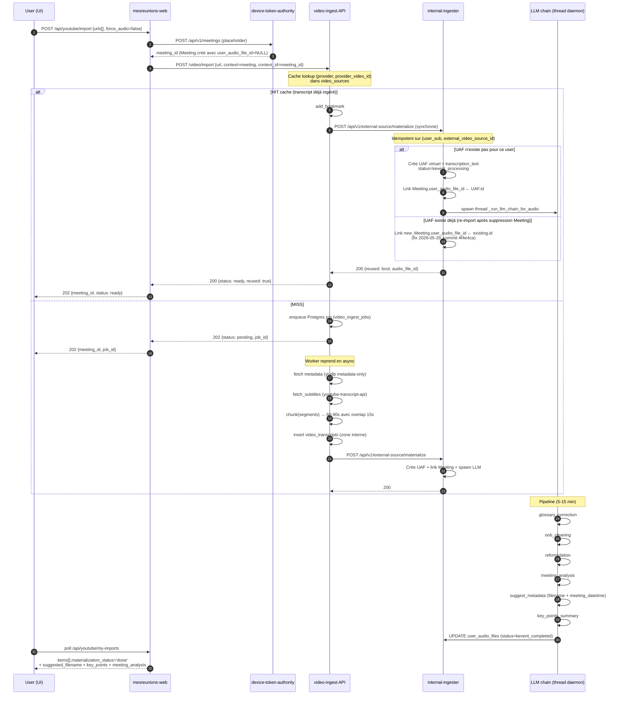
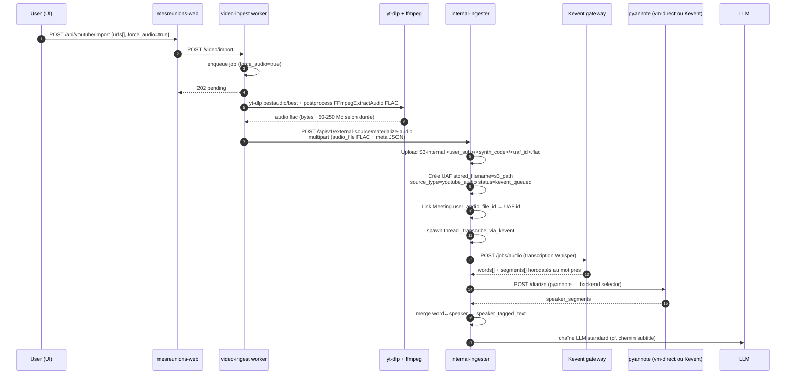
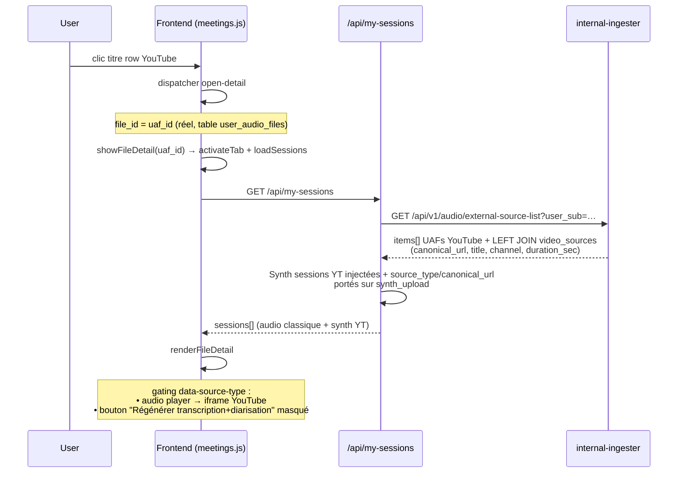

# Flux d'import YouTube — diagramme de séquence + décisions de timing

> Référence : `services/video_ingest/`, `services/dmz-to-internal-bridge/app/external_source.py`,
> `services/mesreunions-web/app/modules/youtube_import/routes.py`.

## 1. Vue d'ensemble

Deux chemins co-existent selon la disponibilité des sous-titres et le
flag `force_audio` :

- **Chemin subtitle** (défaut) : aucun téléchargement audio, transcript
  texte issu de `youtube-transcript-api`, pipeline LLM direct.
- **Chemin force_audio** (depuis Phase B, livrée 2026-05-28) : yt-dlp
  télécharge l'audio en FLAC, transit S3-internal, pipeline standard
  Whisper + pyannote + LLM identique à un upload audio classique.

## 2. Diagramme de séquence — chemin subtitle (HIT cache)



## 3. Diagramme de séquence — chemin force_audio (Phase B)



## 4. Diagramme — fiche détail UI



## 5. État des timings dans le transcript subtitle (problème ouvert)

### Format actuel

`youtube-transcript-api` retourne des chunks fins (~3-5s) **non
sentence-aligned** :

```json
[
  {"text": "Bonjour", "start": 0.0, "duration": 1.5},
  {"text": "monsieur Mensch je", "start": 1.5, "duration": 1.2},
  {"text": "vous remercie de", "start": 2.7, "duration": 1.0},
  {"text": "votre présence", "start": 3.7, "duration": 1.1}
]
```

`video-ingest` les agrège en chunks 60-90s pour le RAG (cf.
`chunking.chunk()`), donc la granularité descendue à materialize est
trop grossière pour un karaoké au mot près.

### Comparaison avec Whisper

| Niveau | YouTube subtitle | Whisper word-level |
|---|---|---|
| Granularité timing | chunk ~3-5s (puis 60-90s post-agrégation video-ingest) | mot (50-300ms) |
| Sentence boundaries | non | non (juste segments diarisation) |
| Speakers | non | oui (via pyannote merge) |
| Format JSON | `[{start_seconds, end_seconds, text}]` | `[{w, s, e}]` |

### Solutions proposées (cf. § suivant)

Voir `docs/connectors/youtube-karaoke-options.md`.
