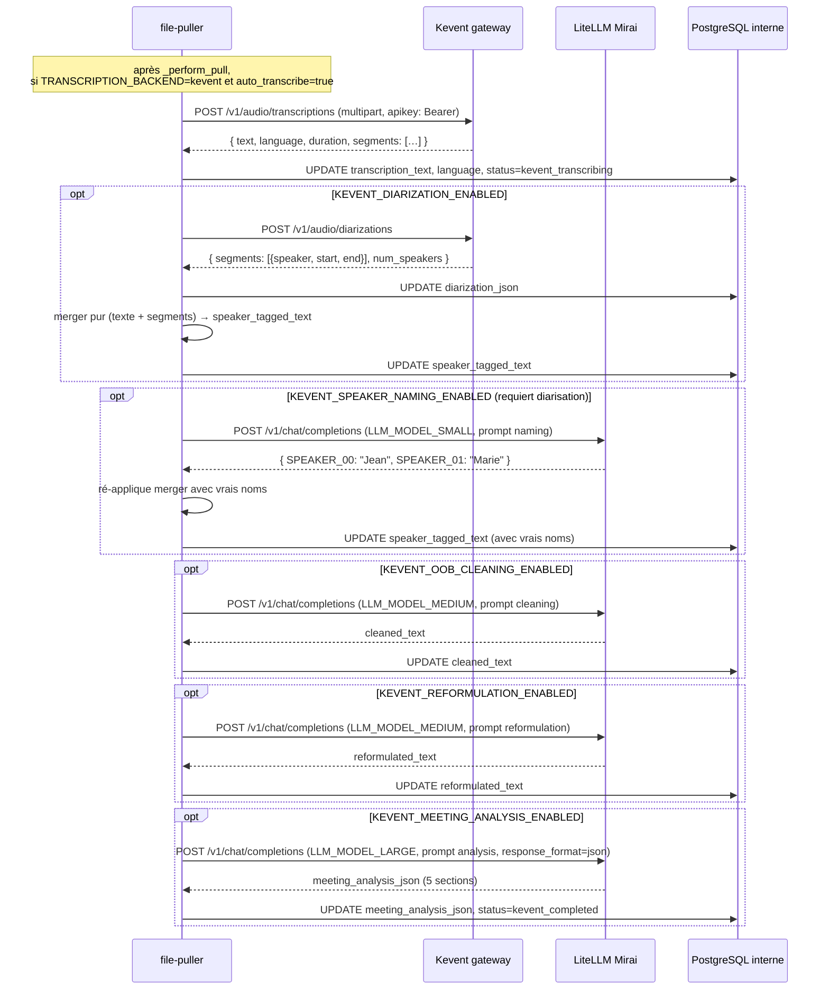

# Intégration Kevent (Mirai) — transcription, diarisation et intelligence de réunion

Ce document décrit le **3e backend de transcription** disponible dans la
pipeline (en plus de `stub` et `mcr` cf [integrate-with-mcr.md](integrate-with-mcr.md)).

Quand `TRANSCRIPTION_BACKEND=kevent`, le `file-puller` n'utilise plus la
queue `transcription` locale ni MCR. À la place, il enchaîne :

1. **Transcription** via `POST /v1/audio/transcriptions` du gateway Kevent
   Mirai (Whisper `faster-whisper-large-v3-turbo`)
2. *(optionnel)* **Diarisation** via `POST /v1/audio/diarizations`
   (pyannote)
3. *(optionnel)* **Speaker name recognition** via LLM léger
4. *(optionnel)* **Out-of-band cleaning** via LLM moyen
5. *(optionnel)* **Reformulation** en discours indirect via LLM moyen
6. *(optionnel)* **Analyse 5-sections** via LLM costaud (acteurs, thèmes,
   décisions, gaps, recommandations)

Chaque étape post-transcription est **toggleable indépendamment** et
**best-effort** : un échec laisse la colonne correspondante NULL et
marque le statut `kevent_partially_completed` — la transcription brute
reste accessible.

## Pipeline complet



## Endpoints Kevent (référence rapide)

```
Base URL  : https://gateway.api.ai.fake-domain.name
Auth      : header "apikey: Bearer <token>"
            (NB : non-standard, pas le standard Authorization)

POST /v1/audio/transcriptions     model=faster-whisper-large-v3-turbo
                                  multipart : file, model, response_format
                                  → { text, language, duration, segments: [...] }

POST /v1/audio/diarizations       model=pyannote-diarization
                                  multipart : file, model
                                  → { segments: [{speaker, start, end}], num_speakers, duration }

LiteLLM (chat for post-processing) :
Base URL  : https://llm.api.ai.fake-domain.name
Auth      : header "Authorization: Bearer <sk-…>"  (standard OpenAI)

POST /v1/chat/completions         model, messages, response_format?, temperature?
                                  → OpenAI-compatible response
```

Tous validés depuis la VM build-vm — cf
`/root/llm-credentials.txt` pour les credentials.

## Schéma DB — colonnes ajoutées par migration 004

| Colonne | Type | Quand |
|---|---|---|
| `transcription_engine` | VARCHAR(50) | `stub` / `mcr` / `kevent` — audit du backend qui a écrit |
| `transcription_language` | VARCHAR(10) | langue ISO-639-1 détectée par Whisper |
| `diarization_json` | TEXT | segments pyannote bruts (NULL si désactivé/échoué) |
| `speaker_tagged_text` | TEXT | Markdown `**SPEAKER_NN**` (vrais noms si naming activé) |
| `glossary_corrected_text` | TEXT | speaker_tagged_text corrigé par LLM (sigles MI, cf migration 005) — NULL si toggle off ou aucun terme matché |
| `cleaned_text` | TEXT | version OOB-cleaned par LLM |
| `reformulated_text` | TEXT | discours indirect par LLM |
| `meeting_analysis_json` | TEXT | analyse 5 sections sérialisée |

## Variables d'environnement

| Variable | Défaut | Description |
|---|---|---|
| `TRANSCRIPTION_BACKEND` | `stub` | `stub` / `mcr` / `kevent` — sélection backend (mutuellement exclusif) |
| `KEVENT_GATEWAY_URL` | `""` | base URL du gateway Kevent (`https://gateway.api.ai.fake-domain.name` en prod) |
| `KEVENT_API_KEY` | `""` | token apikey (cf K8s Secret `kevent-api-key`, clé `kevent_api_key`) |
| `KEVENT_TRANSCRIPTION_MODEL` | `faster-whisper-large-v3-turbo` | nom du modèle Whisper |
| `KEVENT_DIARIZATION_MODEL` | `pyannote-diarization` | nom du modèle diarization |
| `KEVENT_DIARIZATION_ENABLED` | `false` | active l'appel diarization |
| `KEVENT_SPEAKER_NAMING_ENABLED` | `false` | active la résolution des noms via LLM |
| `KEVENT_OOB_CLEANING_ENABLED` | `false` | active le nettoyage OOB via LLM |
| `KEVENT_REFORMULATION_ENABLED` | `false` | active la reformulation discours indirect |
| `KEVENT_MEETING_ANALYSIS_ENABLED` | `false` | active l'analyse 5 sections |
| `KEVENT_GLOSSARY_CORRECTION_ENABLED` | `false` | active la correction LLM des sigles via glossaire (cf section *Glossaire* ci-dessous) |
| `KEVENT_GLOSSARY_DIR` | `/app/glossaire` | dossier des fichiers de glossaire (`.md`/`.txt`/`.json`) lus au démarrage du worker |
| `KEVENT_GLOSSARY_MAX_TERMS_PER_CALL` | `200` | nombre max de termes pertinents passés au LLM par appel (filtre `glossary_loader.filter_relevant`) |
| `KEVENT_HTTP_TIMEOUT_SECONDS` | `600` | timeout par appel Kevent (long pour fichiers volumineux) |
| `LITELLM_BASE_URL` | `""` | LiteLLM (chat hub) base URL |
| `LITELLM_API_KEY` | `""` | bearer LiteLLM (cf K8s Secret, clé `litellm_api_key`) |
| `LLM_MODEL_SMALL` | `chat-small` | modèle pour speaker naming |
| `LLM_MODEL_MEDIUM` | `mistral-small-24b` | modèle pour cleaning + reformulation |
| `LLM_MODEL_LARGE` | `gptoss-120b` | modèle pour meeting analysis |
| `LLM_HTTP_TIMEOUT_SECONDS` | `180` | timeout par appel LLM |

## Activation séquencée en production

1. **Apply migrations 004 + 005** sur postgres-internal :
   ```bash
   for m in 004_kevent_transcription.sql 005_kevent_glossary_correction.sql; do
     kubectl --kubeconfig=$INT exec deploy/postgres-internal -- \
       psql -U audio_int -d audio_upload_int \
       -f /app/migrations/internal/$m
   done
   ```

2. **Provisionner le Secret** `kevent-api-key` dans `audio-internal` :
   ```bash
   kubectl -n audio-internal create secret generic kevent-api-key \
     --from-literal=kevent_api_key="<token Kevent>" \
     --from-literal=litellm_api_key="sk-…" \
     --dry-run=client -o yaml | kubectl apply -f -
   ```

3. **Build + push image** avec le nouveau code, rolling restart file-puller
   (avec `TRANSCRIPTION_BACKEND=stub` toujours — vérifier que rien ne bouge).

4. **Activer le backend Kevent sans sous-toggles** :
   `TRANSCRIPTION_BACKEND=kevent`. Uploader un fichier de test, vérifier que
   `transcription_text` est rempli et que `transcription_status=kevent_completed`.

5. **Activer chaque sous-toggle dans l'ordre, valider à chaque étape** :
   - `KEVENT_DIARIZATION_ENABLED=true` → `diarization_json` + `speaker_tagged_text`
     remplis
   - `KEVENT_SPEAKER_NAMING_ENABLED=true` → vrais noms dans
     `speaker_tagged_text` (requiert que les intervenants se présentent
     dans l'audio)
   - `KEVENT_GLOSSARY_CORRECTION_ENABLED=true` (après migration 005) →
     `glossary_corrected_text` rempli quand des sigles MI sont détectés
     phonétiquement dans la transcription (cf section *Glossaire*)
   - `KEVENT_OOB_CLEANING_ENABLED=true` → `cleaned_text` rempli
   - `KEVENT_REFORMULATION_ENABLED=true` → `reformulated_text` rempli
   - `KEVENT_MEETING_ANALYSIS_ENABLED=true` → `meeting_analysis_json` rempli
     (5 sections JSON valides)

6. **Quality check humain** sur 3 fichiers types (cf
   [tests/scenarios/kevent_quality_check.md](../tests/scenarios/kevent_quality_check.md)).
   Pour une évaluation systématique sur corpus annoté (WER/DER/cpWER,
   ablations pré-traitement / ASR / diarisation / post-traitement),
   suivre [docs/protocole_test_transcription_diarisation.md](protocole_test_transcription_diarisation.md).

7. **Itération sur les prompts** dans
   [`services/file-mover/app/prompts/`](../services/file-mover/app/prompts/)
   selon les résultats. Rebuild + push image après chaque itération
   (les prompts sont embarqués dans l'image — externalisation en
   ConfigMap est en hors-scope).

## Glossaire (correction LLM des sigles)

Whisper transcrit les sigles administratifs **phonétiquement** quand il ne
les reconnaît pas (« deux M L F D I » au lieu de « 2MLFDI », « ah anne ess
cé » au lieu de « ANSC »). L'étape `glossary_correction` injecte un
**glossaire général** (sigles MI, services publics) dans le contexte d'un
appel LLM pour corriger ces passages — uniquement les passages reconnus
avec un score de confiance, le reste de la transcription est laissé tel
quel.

### Pourquoi en post-transcription et non en `prompt` Whisper ?

- Whisper limite le `prompt` (initial_prompt) à **~244 tokens** ≈ 50-100
  termes max. Notre glossaire MI fait 500+ entrées → ne tient pas.
- Le LLM en post-traitement peut faire la correspondance **phonétique
  contextuelle** (« deux M L F D I » → « 2MLFDI ») là où un simple
  remplacement string ne marche pas.
- Le glossaire personnel par utilisateur (TODO follow-up) sera également
  appliqué à ce stade, en ajout du général — pas de surface
  d'envoi du contenu confidentiel à Whisper.

### Format des fichiers glossaire

Le worker scan `KEVENT_GLOSSARY_DIR` (défaut `/app/glossaire`) et accepte :
- **`.md`** : `**TERME** - définition - explication` — seul le terme
  (texte gras) est extrait, les définitions sont **droppées** pour ne
  pas saturer le contexte LLM.
- **`.txt`** : un terme par ligne, lignes commençant par `#` ignorées.
- **`.json`** : liste de strings ou d'objets `{"term": "..."}`.

Les termes sont déduplices et triés alphabétiquement avant filtrage.

### Filtrage par pertinence

Pour chaque transcription, le module `glossary_loader.filter_relevant`
sélectionne au plus `KEVENT_GLOSSARY_MAX_TERMS_PER_CALL` (défaut 200)
termes qui ont une chance de matcher (substring ou décomposition
lettre-par-lettre). Ça évite d'envoyer 500+ entrées au LLM à chaque
appel.

### Déploiement — image vs ConfigMap

Trois modes au choix :

| Mode | Mise à jour glossaire | Avantage |
|---|---|---|
| **Image baked-in** (défaut) | rebuild + push image, rolling restart | simple, pas d'infra extra |
| **ConfigMap K8s** | `kubectl create configmap …` + `rollout restart` | pas de rebuild, ~30 s pour un nouveau glossaire en prod |
| **Volume Docker** (compose) | éditer `glossaire/`, `docker compose restart file-puller` | dev local, pas de rebuild |

Le `volumeMount` ConfigMap dans
[`deploy/kubernetes/internal-zone/deployments.yaml`](../deploy/kubernetes/internal-zone/deployments.yaml)
est déclaré `optional: true` et MASQUE le dossier image quand la
ConfigMap existe — sinon le worker lit le glossaire image. Synchroniser
en une commande :

```bash
KUBECONFIG=…/kubeconfig-internal-gw.yaml \
  ./deploy/kubernetes/scripts/sync-glossary-configmap.sh
```

Le script crée/upserte la ConfigMap depuis `glossaire/` puis
`rollout restart deploy/file-puller` (le worker recharge au boot).

> **Limite ConfigMap K8s** : 1 MiB par ConfigMap. Notre glossaire actuel
> fait ~20 KiB → marge confortable. Au-delà, splitter par fichier ou
> migrer vers un Secret/PVC.

### Position dans le pipeline

```
transcribe → diarize → speaker_naming →
  [NEW] glossary_correction →
oob_cleaning → reformulation → meeting_analysis
```

Placé **avant** OOB cleaning pour que le nettoyage, la reformulation et
l'analyse 5 sections voient les bons sigles. Best-effort comme les
autres steps : un échec LLM ou l'absence de termes pertinents laisse
`glossary_corrected_text = NULL` et la pipeline continue avec le texte
original.

## Sécurité et résilience

- **Erreurs Kevent** classifiées en 3 familles, comme MCR :
  - `KeventAuthError` (401/403) → `kevent_failed`, **pas** de retry. Action
    ops : rotation de l'API key ou élargissement du `consumer_group_id`
    côté Mirai.
  - `KeventApplicativeError` (422 inference failed, 4xx autres) →
    `kevent_failed`, pas de retry.
  - `KeventTransientError` (5xx, timeout, network) → exception remontée,
    retry via le compteur `x-retry-count` (PR #4). Au-delà de
    `QUEUE_MAX_RETRIES=5`, drop.

- **Erreurs LLM** (LiteLLM) classifiées pareillement, mais traitées en
  **best-effort** : un échec d'une étape post-transcription laisse la
  colonne NULL et marque `kevent_partially_completed`. La transcription
  brute reste accessible et utilisable.

- **Prompt injection** : un attaquant qui contrôle le contenu audio
  pourrait essayer de manipuler les LLM ("ignore previous instructions").
  Mitigation actuelle : prompts robustes (formulation impérative
  défensive). Mitigation avancée (sanitization, isolation par
  niveaux) hors scope ici — à proposer en PR ultérieure si la surface
  devient préoccupante.

- **Coût LLM** : 5 calls par fichier dans le cas le plus complet
  (~speaker naming + 2 medium calls + 1 large call). Pour 100
  fichiers/jour avec ~8k tokens chacun, le compteur monte vite. Pas de
  monitoring de coût en place — à mettre en suivi (TODO Langfuse /
  Helicone).

## Hors scope (PR ultérieures)

- Externalisation des 4 prompts en ConfigMap pour itérer sans rebuild
  image
- Mode async Kevent (`/jobs/{service_type}` avec callback URL) pour les
  fichiers très longs (>10 min de processing)
- Token-based observability (Langfuse) pour suivre le coût LLM
- Webhook entrant pour notifier la fin d'un long pipeline
- Multilangue (aujourd'hui auto-détection Whisper, prompts en français)
