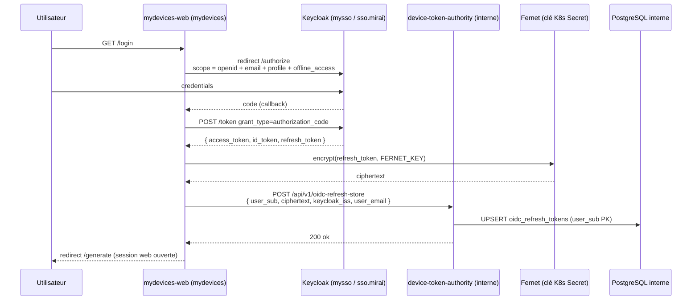
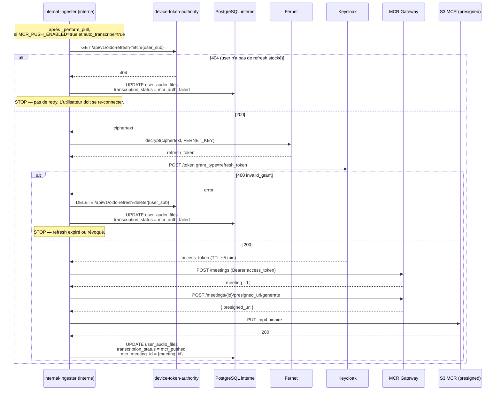
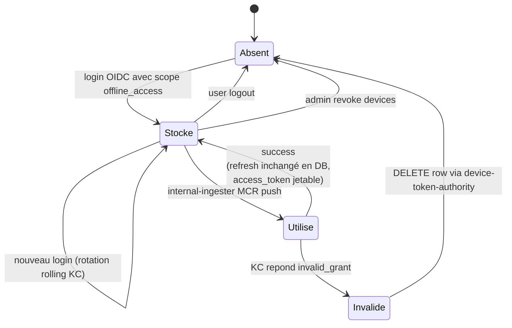

# Intégration MCR — push automatique de l'audio pour transcription

Ce document décrit comment **mydevices** (l'application audio-upload)
pousse les fichiers audio transcodés vers la plateforme **MCR** (le service
de transcription externe — repo local `mcr` également) pour qu'ils soient
intégrés à une réunion et transcrits.

## Vue d'ensemble

Le push n'est pas effectué par le téléphone de l'utilisateur ni par sa
session web : il a lieu **après** que l'utilisateur ait fermé son
navigateur, depuis le `internal-ingester` côté zone protégée, dès qu'un fichier
sort du pipeline interne (download depuis S3 audio-processed → upload S3
audio-internal → INSERT `user_audio_files`).

Pour appeler MCR au nom de l'utilisateur, on a besoin d'un **access
token Keycloak frais**. Comme la session web a expiré, on utilise un
**refresh token persisté** capturé au login et stocké chiffré côté serveur.

## Diagramme 1 — Capture du refresh token au login mydevices



L'admin-console suit le même flux. Le `refresh_token` plaintext n'est jamais
journalisé, jamais persisté en clair, et `device-token-authority` (qui fait l'écriture
DB) n'a pas besoin de la clé Fernet — il stocke et restitue uniquement le
ciphertext.

## Diagramme 2 — Push MCR (internal-ingester, asynchrone)



Trois familles d'erreurs sont distinguées dans
[mcr_client.py](../services/dmz-to-internal-bridge/app/mcr_client.py) :

- **`MCRAuthError`** (refresh expiré, 401/403 sur `/meetings`) ⇒ on
  supprime le ciphertext + on marque `mcr_auth_failed`. **Pas de retry**.
- **`MCRApplicativeError`** (4xx applicatif : payload invalide, fichier
  trop gros) ⇒ on marque `mcr_rejected`. **Pas de retry**.
- **`MCRTransientError`** (5xx, timeout, connexion coupée) ⇒ exception
  remontée au consumer de la queue `internal_pull` qui retry via le
  compteur `x-retry-count` (PR précédente). Au-delà de
  `QUEUE_MAX_RETRIES=5`, drop avec `mcr_push_failed`.

## Diagramme 3 — Cycle de vie du refresh token



Quand un user passe en `Absent` (logout, expiration, révocation), le
prochain push MCR le marquera `mcr_auth_failed` jusqu'à ce qu'il se
relogge sur mydevices. C'est le comportement voulu — on n'inférere jamais
un refresh token utilisateur sans son consentement explicite.

## Sécurité du stockage

- **Fernet symétrique** (clé 256 bits, URL-safe base64) générée une fois
  et stockée dans le K8s Secret `oidc-refresh-token-encryption` (clé
  `key`). Helper : [`libs/shared/app/secrets_crypto.py`](../libs/shared/app/secrets_crypto.py).
- Le **plaintext** n'apparaît jamais en logs ni en DB. Seule la fonction
  `_push_to_mcr` côté internal-ingester le manipule en mémoire le temps
  d'appeler Keycloak ; l'access_token résultant est utilisé puis jeté.
- `device-token-authority` qui fait l'UPSERT/SELECT/DELETE sur `oidc_refresh_tokens`
  est **key-blind** : il ne possède pas la clé Fernet, ne peut pas
  déchiffrer. Compromission de device-token-authority = perte des ciphertexts mais
  pas du contenu.
- **Rotation de la clé** : génère une nouvelle clé, ré-encrypte
  l'intégralité de `oidc_refresh_tokens` avec la nouvelle clé puis swap
  l'env var. Procédure scriptée hors scope de cette PR.

## Activation du push MCR

Le push est gardé derrière deux env vars indépendantes :

- `OIDC_OFFLINE_ACCESS=true` (côté mydevices-web + admin-console) — fait
  demander le scope `offline_access` à Keycloak et capturer le refresh.
  Sans ça, aucun refresh n'est stocké et tous les push échoueront en
  `mcr_auth_failed`.
- `MCR_PUSH_ENABLED=true` (côté internal-ingester) — bascule le `_perform_pull`
  sur le push MCR au lieu de la queue locale `transcription`.

**Ordre de bascule recommandé** :

1. Demander à l'admin SSO d'ajouter le scope `offline_access` au client
   Keycloak `audio-upload`.
2. Provisionner le secret K8s `oidc-refresh-token-encryption` dans
   `audio-internal` (et `audio-external` pour la base intégration) :
   ```bash
   KEY=$(python3 -c 'from cryptography.fernet import Fernet; print(Fernet.generate_key().decode())')
   kubectl -n audio-internal create secret generic oidc-refresh-token-encryption \
     --from-literal=key="$KEY" --dry-run=client -o yaml | kubectl apply -f -
   ```
3. Apply la migration `migrations/internal/003_oidc_refresh_tokens.sql`.
4. Apply les nouvelles versions de mydevices-web + admin-console avec
   `OIDC_OFFLINE_ACCESS=true`. Les utilisateurs qui se reloggent
   commencent à avoir leur refresh token persisté. Le push reste sur le
   stub.
5. **Attendre 7-14 jours** que la majorité des users soit re-loggée
   (sinon ils seront bloqués en `mcr_auth_failed` au push). Communiquer
   "veuillez vous reconnecter" dans l'UI si nécessaire.
6. Renseigner `MCR_GATEWAY_URL` (à fournir par l'équipe MCR) et
   `OIDC_TOKEN_ENDPOINT` (URL Keycloak token endpoint, déjà préparée
   dans le patch prod-bêta), flip `MCR_PUSH_ENABLED=true`, rolling
   restart internal-ingester.
7. Monitorer les premiers `transcription_status` qui passent à
   `mcr_pushed` (succès) vs `mcr_auth_failed` (utilisateurs à re-logger).

## API MCR — séquence détaillée (référence développeur)

Prérequis : un access token Keycloak valide (header `Authorization: Bearer
<TOKEN>`) et l'URL de base de la gateway (ex. `https://<gateway-host>`).

### 1. Créer une réunion

```bash
curl -X POST "https://<gateway-host>/meetings" \
  -H "Authorization: Bearer $TOKEN" \
  -H "Content-Type: application/json" \
  -d '{
    "name": "Ma réunion",
    "name_platform": "IMPORT",
    "creation_date": "2026-04-24T10:00:00.000Z",
    "start_date": "2026-04-24T10:00:00.000Z",
    "end_date": "2026-04-24T11:00:00.000Z"
  }'
```

→ retourne `meeting_id`.

### 2. Générer une URL présignée d'upload

```bash
curl -X POST "https://<gateway-host>/meetings/<MEETING_ID>/presigned_url/generate" \
  -H "Authorization: Bearer $TOKEN" \
  -H "Content-Type: application/json" \
  -d '{
    "filename": "mon-audio.mp3"
  }'
```

→ retourne `presigned_url`.

### 3. Uploader le fichier sur l'URL présignée

```bash
curl -X PUT "<PRESIGNED_URL>" \
  -H "Content-Type: audio/mpeg" \
  --data-binary "@mon-audio.mp3"
```

Une réponse HTTP 200 (corps vide) indique que le fichier a bien été
déposé. MCR prendra ensuite le relais pour la transcription et la
génération de rapport selon le flux MCR habituel.

### Résumé du flux

```
POST /meetings                                  → meeting_id
POST /meetings/{meeting_id}/presigned_url/generate → presigned URL
PUT  <presigned URL>                            → 200 (corps vide)
```

## Questions ouvertes à l'équipe MCR

À résoudre avant la mise en service prod-bêta :

1. **Audience JWT acceptée** : MCR accepte-t-il un access token Keycloak
   du realm `openwebui` (audience `audio-upload` ?) ou faut-il un client
   séparé / une audience spécifique ?
2. **Format des dates** : RFC 3339 millisecondes (ce qui est dans
   l'exemple) ou ISO 8601 simple ? Timezone toujours UTC ?
3. **Champs requis exhaustifs** sur `POST /meetings` : `name`,
   `name_platform`, dates — y a-t-il `description`, `participant_emails`,
   `language`, etc. ?
4. **TTL de la presigned URL** : combien de temps elle reste valide
   entre l'étape 2 et l'étape 3 (impact sur la durée du `_push_to_mcr`
   qui doit tout faire dans la même invocation) ?
5. **Idempotency** : si le même message est rejoué (retry après timeout
   transitoire), MCR accepte-t-il deux POST identiques ou faut-il une
   `Idempotency-Key` ?
6. **Limite de taille audio** : on sort du `.mp4` jusqu'à 256 MB
   (`UPLOAD_MAX_FILE_SIZE_MB=256` côté mobile-upload-pwa). MCR accepte-t-il
   sans transcoder à nouveau ?
